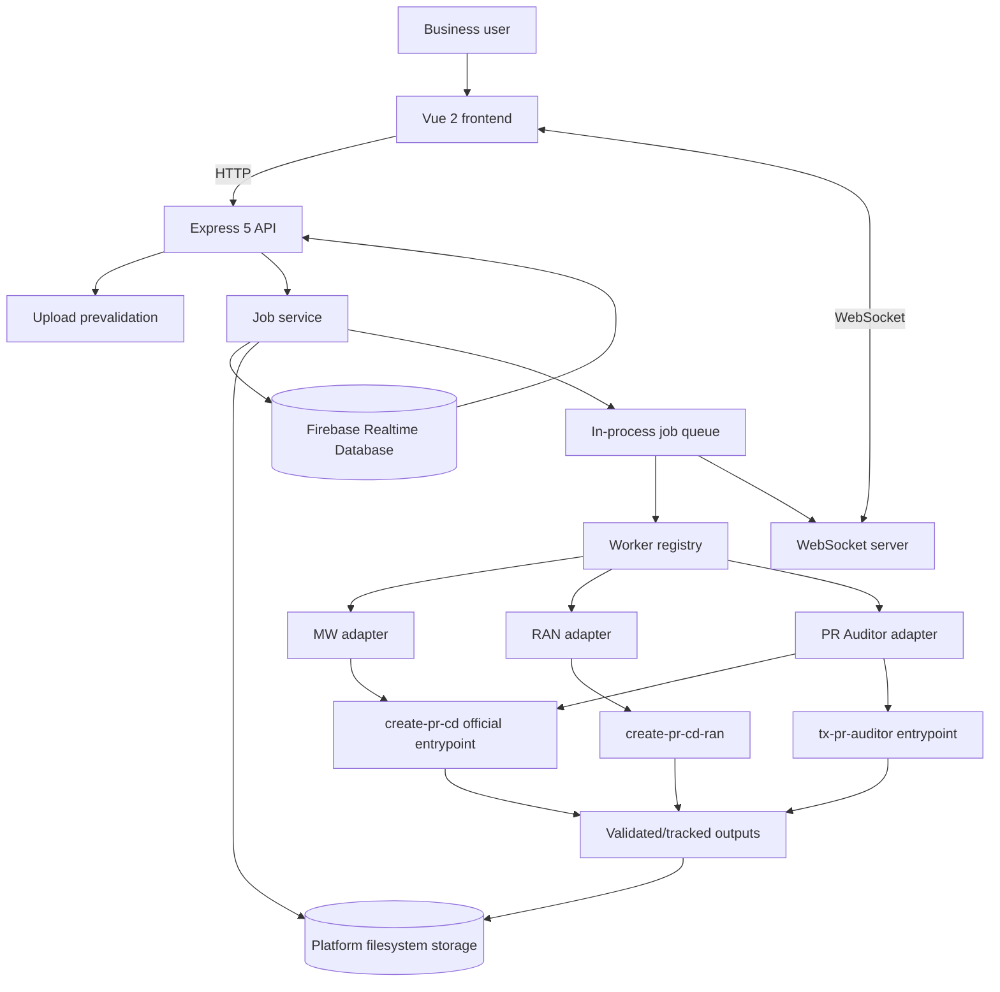
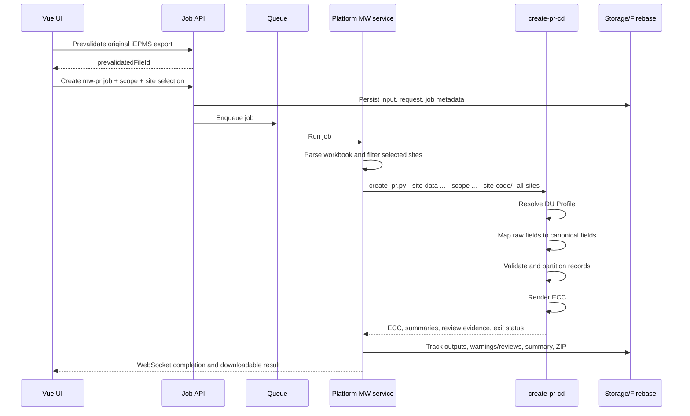

# AI Worker Platform Detailed Handover Specification

## Document control

| Field | Value |
| --- | --- |
| Document | `DETAILS.md` |
| Purpose | Technical design, operating contract, and handover reference |
| Repository | `ai-worker-platform` |
| Prepared from | Source code present on 29 July 2026 |
| Platform commit inspected | `a61c44314167f97f3fe1da096f41690a746e2d58` |
| Approved MW engine gitlink | `98412d7ecab8e1ba6c53e170f3ffea30b75b3443` |
| Approved auditor gitlink | `abf3316af47ff35ff653f5b680d381a32ae3c49a` |
| Approved RAN engine gitlink | `239910e2816153339a94881597bbb95355059741` |
| Companion review | `ANALYSIS.md` |

This document describes the intended and implemented system contracts. Current checkout deviations, ambiguous rules, defects, and cleanup recommendations are intentionally kept in `ANALYSIS.md`.

## 1. System purpose

AI Worker Platform is an internal web application that exposes approved business engines through a shared job lifecycle. It provides:

- browser-based upload, worker selection, scope/site selection, progress, history, and download;
- upload prevalidation and job creation;
- an in-process queue with cancellation and timeout handling;
- isolated per-job filesystem workspaces;
- Firebase Realtime Database metadata persistence;
- WebSocket progress and heartbeat events;
- deterministic summaries with optional LLM wording;
- runtime pin and fingerprint checks for the MW PR and PR Auditor engines.

The platform supports three worker IDs:

| Worker | ID | Business-rule owner | Platform role |
| --- | --- | --- | --- |
| MW PR Worker | `mw-pr` | `skills/create-pr-cd` | Upload, site/scope selection, official engine invocation, output/error collection |
| RAN PR Worker | `ran-pr` | `skills/create-pr-cd-ran` | Upload, mode/project selection, isolated pipeline invocation, validated output collection |
| PR Auditor | `pr-auditor` | `skills/create-pr-cd` and `skills/tx-pr-auditor` | Generate TSS/TI entitlement, invoke downstream audit, collect report and summary |

## 2. Architectural ownership

### 2.1 `ai-worker-platform` owns

- Vue user interface and navigation;
- upload transport and technical prevalidation;
- worker, scope, site, run-mode, project, and audit-period selection;
- job IDs, idempotency, queueing, cancellation, timeouts, and state transitions;
- safe child-process execution;
- per-job storage and tracked file metadata;
- output validation, ZIP packaging, history, and downloads;
- safe error presentation, WebSocket events, health, and optional LLM wording;
- approved engine commit and runtime fingerprint declarations.

### 2.2 `create-pr-cd` owns

- original four-header iEPMS export interpretation;
- DU identity and DU Profile resolution;
- exact raw-header fingerprint to canonical-field mapping;
- canonical source evidence and scope-required-field validation;
- controlled Tx SOW normalization;
- PR Model and contract-reference interpretation;
- TSS/TI item selection;
- ECC generation and engine-owned review evidence.

The formal integration entrypoint is:

```text
skills/create-pr-cd/scripts/create_pr.py
```

The platform must not select DU Profiles, define source-column aliases, or reproduce PR Model rules.

### 2.3 `tx-pr-auditor` owns

- reading a submitted Final PO workbook;
- reading ECC entitlement generated by `create-pr-cd`;
- canonicalizing Final PO and ECC rows;
- resolving registered DU identity evidence;
- site/DU, scope, item, and subcontractor comparison;
- deterministic entitlement-quantity consumption;
- Normal, Invalid PO, Wrong PO, and Duplicate PO classification;
- audit workbook, summary JSON, and optional annotated ECC copies.

`tx-pr-auditor` must not read EPMS or PR Model directly. In the web flow, EPMS is uploaded because the platform first invokes `create-pr-cd` to produce audit entitlement.

## 3. Logical architecture



## 4. Repository structure

```text
ai-worker-platform/
├── frontend/                         Vue 2 + Vite application
│   ├── src/api/                      HTTP client functions
│   ├── src/components/               Shared job, upload, result, and admin UI
│   ├── src/config/                   Worker navigation
│   ├── src/services/                 WebSocket and admin-session clients
│   ├── src/views/                    PR Creator, PR Auditor, History, Detail, Admin
│   └── src/views/shared/             Shared live worker runtime mixin
├── backend/                          Node.js 20+ Express application
│   ├── src/config/                   Environment parsing
│   ├── src/db/                       Firebase REST client and health state
│   ├── src/llm/                      Optional provider-neutral wording/re-ask layer
│   ├── src/models/                   Firebase-backed model compatibility layer
│   ├── src/queue/                    In-memory queue and concurrency gate
│   ├── src/routes/                   Health, jobs, and admin HTTP routes
│   ├── src/services/                 Job lifecycle, storage, execution, reporting
│   ├── src/websocket/                Subscription, event, and heartbeat handling
│   └── src/workers/                  Registry, manifests, adapters, worker services
├── skills/
│   ├── create-pr-cd/                 MW PR/ECC business engine submodule
│   ├── create-pr-cd-ran/             RAN engine submodule
│   └── tx-pr-auditor/                TX PR audit engine submodule
├── storage/                          Generated runtime data; not source controlled
├── docs/                             Architecture, decisions, test evidence, history
├── requirements-worker.txt           Shared Python dependencies
├── docker-compose.yml                Container composition
├── .env.example                      Local environment template
└── .gitmodules                       Engine repository definitions
```

## 5. Runtime technology

| Layer | Technology |
| --- | --- |
| Frontend | Vue `2.7`, Vue Router `3`, Axios, Vite `7`, Vitest |
| Backend | Node.js `>=20`, Express `5`, `ws`, Multer, ExcelJS, SheetJS |
| Engine runtime | Python 3, pandas, openpyxl, PyYAML and engine requirements |
| Metadata database | Firebase Realtime Database over REST |
| Binary/generated storage | Local or mounted filesystem under `STORAGE_ROOT` |
| Packaging | `archiver` ZIP output |
| Optional language model | OpenAI-compatible Qwen or Agnes provider |

Python resolution order is:

1. `PYTHON_EXECUTABLE`;
2. repository `.venv`;
3. `python` on Windows or `python3` on Linux/macOS, resolved to an executable path.

Child processes run with `shell: false`, hidden windows on Windows, UTF-8 Python I/O, a configured timeout, and a cancellation poll.

## 6. Frontend design

### 6.1 Routes

| Route | View | Purpose |
| --- | --- | --- |
| `/` | redirect | Redirects to PR Creator |
| `/workers/pr-creator` | `PRCreatorView.vue` | MW and RAN job creation |
| `/workers/pr-auditor` | `PRAuditorView.vue` | Final PO + EPMS audit job creation |
| `/history` | `JobHistoryView.vue` | Paginated/filterable job history |
| `/jobs/:jobId` | `JobDetailView.vue` | Persistent job detail, files, timeline, re-ask |
| `/dashboard` | `DashboardView.vue` | Dashboard |
| `/admin/login` | `AdminLoginView.vue` | Admin login |
| `/admin/health` | `AdminHealthView.vue` | Service health |
| `/admin/assets` | `AdminAssetsView.vue` | Presentational route; backend mutation is disabled |
| `/admin/audit-logs` | `AdminAuditLogsView.vue` | Admin action logs |

The primary worker navigation exposes PR Creator and PR Auditor.

### 6.2 PR Creator flow

For MW:

1. Select MW PR Worker.
2. Upload an iEPMS export.
3. Prevalidate it.
4. Select `TSS` or `TI`.
5. Select `all_sites` or `site_code`.
6. Submit a job with a browser-tab session ID and idempotency key.
7. Subscribe to the job through WebSocket.
8. Display progress, final counts, warnings/review items, and ZIP download.

For RAN:

1. Upload and prevalidate BOM and EPMS.
2. Select Standard PR or General Item.
3. Select a project when required.
4. Submit, monitor, and download the validated result package.

### 6.3 PR Auditor flow

1. Upload and prevalidate Final PO.
2. Select audit year and month.
3. Upload and prevalidate EPMS.
4. Submit a `pr-auditor` job.
5. Monitor entitlement generation and audit execution.
6. Download `PR_Audit_Result.xlsx`.

### 6.4 Browser runtime state

`frontend/src/views/shared/workerRuntime.js` maintains:

- one browser-tab session identifier;
- per-worker pending idempotency keys;
- selected job ID;
- active jobs for the current tab;
- WebSocket connection and event console;
- job detail, summary, warnings, review items, and output availability;
- cancellation form state;
- deterministic error messaging and optional re-ask.

## 7. Backend HTTP contract

### 7.1 Public job routes

| Method | Route | Contract |
| --- | --- | --- |
| `POST` | `/api/jobs/prevalidate` | Multipart `file`, optional `uploadKind`; returns checklist and one-time `prevalidatedFileId` |
| `POST` | `/api/jobs` | Creates or idempotently replays a worker job |
| `GET` | `/api/jobs` | Lists jobs with pagination and filters |
| `GET` | `/api/jobs/ran-projects` | Lists backend-approved RAN projects |
| `GET` | `/api/jobs/:jobId` | Returns job, worker state, files, warnings, reviews, summary |
| `POST` | `/api/jobs/:jobId/cancel` | Requests queued or running cancellation |
| `POST` | `/api/jobs/:jobId/rerun` | Copies retained original inputs into a new job |
| `GET` | `/api/jobs/:jobId/download-zip` | Downloads tracked ZIP |
| `GET` | `/api/jobs/:jobId/download/:fileId` | Downloads one tracked file |
| `POST` | `/api/jobs/:jobId/ask` | Answers a question from safe job context |

### 7.2 Upload kinds

| Upload kind | Intended worker | Prevalidation |
| --- | --- | --- |
| `mw-export` | `mw-pr` | Workbook structure and row limit using iEPMS parser |
| `ran-bom` | `ran-pr` | Workbook readability and RAN BOM semantics |
| `ran-epms` | `ran-pr` | iEPMS inspection |
| `pr-auditor-final-po` | `pr-auditor` | Workbook readability |
| `pr-auditor-epms` | `pr-auditor` | Workbook readability |

Allowed backend extensions are `.xlsx`, `.xls`, and `.xlsm`. The upload token is consumed once when the job is created.

### 7.3 MW job creation payload

```json
{
  "workerId": "mw-pr",
  "browserTabSessionId": "tab-...",
  "idempotencyKey": "mw-pr-...",
  "prevalidatedFileId": "preval-...",
  "prScope": "TSS",
  "generationScope": "site_code",
  "siteCodes": ["B00577", "K00340"]
}
```

Rules:

- `prScope` is `TSS` or `TI`;
- `generationScope` is `site_code` or `all_sites`;
- site codes are required for `site_code`;
- duplicate site codes are normalized away;
- the maximum site count comes from `MAX_SITE_CODES`.

### 7.4 PR Auditor job creation payload

```json
{
  "workerId": "pr-auditor",
  "browserTabSessionId": "tab-...",
  "idempotencyKey": "pr-auditor-...",
  "finalPoPrevalidatedFileId": "preval-...",
  "epmsPrevalidatedFileId": "preval-...",
  "auditYear": 2026,
  "auditMonth": 7
}
```

Year and month must be supplied together. Year range is 2000–2100 and month range is 1–12.

### 7.5 Admin routes

Admin login returns a JWT. All other admin routes require a bearer token.

- asset upload and activation deliberately return `ASSET_MANAGEMENT_DISABLED`;
- audit logs are readable by an authenticated admin;
- deployment starts configured host scripts and records an audit event.

## 8. Job lifecycle

### 8.1 Job statuses

```text
queued
  → validating
  → filtering_sites or loading_assets
  → generating
  → exporting
  → completed | completed_with_warning | failed
```

Cancellation introduces:

```text
queued/running → cancelling → cancelled | cancelled_with_partial_result
```

Other defined status:

- `waiting_for_user_input`

Terminal statuses are:

- `completed`
- `completed_with_warning`
- `failed`
- `cancelled`
- `cancelled_with_partial_result`

### 8.2 Queue and concurrency

`backend/src/queue/jobQueue.js` owns in-memory arrays/sets for queued, active, and known jobs. It:

- limits active jobs with `MAX_CONCURRENT_JOBS`;
- resolves the adapter from persisted `workerId`;
- invokes the adapter;
- drains again when execution completes;
- supports queued removal and running cancellation requests.

### 8.3 Idempotency

Every create request requires:

- `browserTabSessionId`: 8–120 characters;
- `idempotencyKey`: 8–160 characters.

The backend uses an in-process reservation to serialize same-key requests and queries persisted jobs by `(workerId, idempotencyKey)`. A repeated request returns the existing job with `created: false`.

### 8.4 Cancellation and timeout

- queued jobs are removed before execution;
- running jobs receive a cancellation flag polled by child-process runners;
- child processes receive `SIGTERM`, then `SIGKILL` after five seconds if necessary;
- timeout defaults to `JOB_TIMEOUT_MINUTES`;
- valid partial files produce `cancelled_with_partial_result`;
- cancelled outputs are explicitly not presented as a complete delivery.

## 9. Persistence and storage

### 9.1 Firebase metadata

Firebase paths hold:

- jobs;
- job files;
- warnings;
- review-required items;
- admin users;
- admin audit logs;
- health state.

The model layer presents a Mongoose-like API (`find`, `findOne`, `updateOne`, `insertMany`, `deleteMany`) over Firebase REST. Deletes are logical tombstones.

### 9.2 Filesystem layout

Base folders:

```text
storage/
├── jobs/
│   └── <job-id>/
│       ├── input/
│       ├── filtered/
│       ├── output/
│       ├── reports/
│       └── temp/
├── assets/
├── outputs/
├── temp/
└── ran-workspaces/
```

All constructed paths pass root-containment checks. Uploaded names and path segments are sanitized. Metadata stores a storage-relative path, size, retention deadline, availability, and cleanup state.

### 9.3 WebSocket contract

Clients connect to `/ws` and send:

```json
{
  "action": "subscribe",
  "jobId": "PR-..."
}
```

Message types:

- `SUBSCRIBED`
- `UNSUBSCRIBED`
- `JOB_EVENT`
- `JOB_HEARTBEAT`
- `SNAPSHOT`
- `ERROR`

Events include status, phase, progress, timestamp, message, and optional summary. The frontend reconnects after three seconds and refreshes persistent detail at terminal state.

## 10. MW PR Worker end-to-end flow



The platform-side filter preserves all source rows up to the detected header plus selected data rows in `filtered_site_pr_po_view.xlsx`. The engine remains responsible for interpreting the four-header structure.

## 11. `create-pr-cd` technical specification

### 11.1 Formal CLI

```powershell
python skills/create-pr-cd/scripts/create_pr.py `
  --site-data "EPMS.xlsx" `
  --output "output" `
  --scope TSS `
  --all-sites
```

Specific sites:

```powershell
python skills/create-pr-cd/scripts/create_pr.py `
  --site-data "EPMS.xlsx" `
  --output "output" `
  --scope TI `
  --site-code "B00577,K00340"
```

Arguments:

| Argument | Required | Meaning |
| --- | --- | --- |
| `--site-data` | Yes | Original four-header `.xlsx`, `.xlsm`, or `.csv` export |
| `--output` | Yes | Output directory |
| `--scope` | Yes | `TSS` or `TI` |
| `--site-code` | Exactly one selection mode | Comma-separated site codes |
| `--all-sites` | Exactly one selection mode | Select all canonical records |
| `--pr-model` | No | Defaults to approved `Info/input/pr_model.xlsx` |
| `--template` | No | Defaults to `Info/input/ecc_template.xls` |
| `--mapping` | No | Defaults to contract/geography reference Markdown |

### 11.2 DU Profile resolution

Resolution is fail-closed:

1. Build a four-header inventory from rows 1–4.
2. Derive exact header fingerprints.
3. Extract the DU model ID and View ID from `site|fix00012|...` field codes.
4. Require exactly one detected `(du_model_id, view_id)`.
5. Match it against `mw_du_profile_identity_registry.yaml`.
6. Require exactly one matching profile.
7. Load and structurally validate the profile file.
8. Require profile status `PR_INPUT_READY` or `PRODUCTION`.
9. Recheck model and View identity against the profile.
10. Calculate the full header hash.
11. Require the hash to be in `approved_header_hashes`.

Primary resolution errors:

| Code | Meaning |
| --- | --- |
| `DU_IDENTITY_NOT_UNIQUE` | Export has zero or multiple DU model/View identities |
| `DU_PROFILE_NOT_FOUND` | Model ID is not registered |
| `DU_PROFILE_VIEW_NOT_APPROVED` | Model exists but View is not approved |
| `DU_PROFILE_AMBIGUOUS` | Multiple profiles match |
| `DU_PROFILE_FILE_MISSING` | Registered profile file is absent |
| `DU_PROFILE_NOT_RUNNABLE` | Profile lifecycle is not runnable |
| `DU_PROFILE_IDENTITY_MISMATCH` | Profile and export identity differ |
| `HEADER_HASH_REVALIDATION_REQUIRED` | Four-header layout is not approved |

### 11.3 Profile schema

Each profile contains:

- `profile_id`, `profile_version`, `mapping_version`, and lifecycle `status`;
- `identity.project_key`;
- accepted DU names, model IDs, and View IDs;
- `export_structure.header_rows`, strict hash policy, approved hashes;
- `field_mapping` entries with:
  - `required`;
  - exact source candidates;
  - four-part fingerprint;
  - mapping lifecycle status;
  - optional transforms and selection mode.

The four fingerprint fields are:

```text
field_code
wbs_stage
task_name
display_header
```

Mapping never falls back to display-header aliases or hard-coded source column positions.

### 11.4 DU identity support matrix

The identity registry contains nine unique Project + DU Model identities and ten profile files:

| Identity | Project | Model ID | Profile(s) | Current generation state |
| --- | --- | --- | --- | --- |
| TX Mini Project | `Malaysia_CelcomDigi_Project` | `4188808420049567786` | `tx_mini_pr_v1` | Runnable |
| 2023 TX Rollout | `Malaysia_CelcomDigi_Project` | `1027190858144623081` | `tx_rollout_2023_pr_v1` | Runnable |
| MW EOS Swap | `CelcomDigi_MW` | `5440935430300168497` | `mw_eos_swap_pr_v1` | Runnable |
| 2023 Celcomdigi BAU | `Malaysia_CelcomDigi_Project` | `8296022438223590261` | `celcomdigi_bau_2023_pr_v1` | Runnable |
| 2024 Celcomdigi BAU | `Malaysia_CelcomDigi_Project` | `7278317398457076992` | `celcomdigi_bau_2024_pr_v1` | Runnable |
| Celcomdigi USP | `Malaysia_CelcomDigi_Project` | `3765504705612341090` | `celcomdigi_usp_pr_v1` | Runnable |
| Jendela TX Migration | `Malaysia_CelcomDigi_Project` | `4972593269368006257` | `jendela_tx_migration_pr_v1` | Runnable |
| ZTE TX MINI | `CelcomDigi_MW` | `8638668101234290847` | `zte_tx_mini_pr_v1` | Runnable |
| CD consolidation 2023 | `Malaysia_CelcomDigi_Project` | `8359047522524182050` | decom + rollout profiles | Recognized; both profiles are `DRAFT` |

Therefore, “nine-DU support” currently means nine identities are governed and recognized. Eight are runnable for ECC generation; the ninth is deliberately fail-closed pending consolidation approval and header hashes.

### 11.5 Canonical PR Site Record v1

Top-level sections:

```text
schema_version
identity
site
pr_context
technical_context
source_evidence
validation
```

Important identity fields:

- project key and optional project ID;
- DU model name and ID;
- View ID;
- source file name and SHA hash;
- header hash;
- source row number.

Important site and PR context:

- site code, site name, DU key;
- raw and normalized Tx SOW;
- upgrade scope, region, state;
- TSS/TI/planning subcontractor;
- existing TSS/TI PR status.

Technical context:

- latitude and longitude;
- NE/FE antenna sizes;
- BOQ configuration;
- Tx, NE, and FE SOW details.

Every mapped value keeps:

- exact source header fingerprint;
- raw source value;
- transformation;
- mapping status.

### 11.6 Scope-required fields

TSS requires canonical evidence for:

- `site_code`
- `tx_sow_raw`
- `tx_sow_normalized`
- `region`
- `subcontractor_tss`
- `existing_tss_pr_status`

TI requires:

- `site_code`
- `tx_sow_raw`
- `tx_sow_normalized`
- `region`
- `subcontractor_ti`
- `existing_ti_pr_status`

Validation classifications:

- `PR_INPUT_READY`
- `PR_INPUT_READY_WITH_REVIEW`
- `PR_INPUT_INCOMPLETE`
- `PR_INPUT_QUARANTINED`

### 11.7 Controlled transforms

Supported mapping transforms:

- `trim`
- `uppercase`
- `parse_decimal`
- `normalize_pr_reference_status`

Existing PR reference normalization:

| Raw value | Canonical state |
| --- | --- |
| Blank | `NO_PR` |
| Begins with `No PR required` | `NO_PR_REQUIRED` |
| Other nonblank reference | `PR_EXISTS` |

Tx SOW normalization uses `canonical_sow_registry.yaml` and is fail-closed:

- `PR_TRIGGER` → `APPROVED`;
- `NO_PR_TRIGGER` → `APPROVED_NO_OUTPUT`;
- unknown or review-required → no eligible output.

### 11.8 Selection and partition

After canonicalization, records are selected by all sites or exact site codes. Missing requested sites fail with `SITE_CODES_NOT_FOUND`.

Selected records are partitioned into:

- `candidates`;
- `duplicates`;
- `ignored`;
- `review_required`.

Shared rules:

- blank scope subcontractor → ignored;
- `APPROVED_NO_OUTPUT` SOW → ignored;
- non-ready canonical classification → review required;
- non-approved SOW normalization → review required.

TI additionally:

- `PR_EXISTS` → duplicate;
- `NO_PR_REQUIRED` → ignored.

### 11.9 ECC renderer

Eligible canonical records are converted into a temporary internal workbook with controlled renderer headers. The renderer:

- verifies the approved PR Model SHA-256;
- loads the PR Model and contract/geography mapping;
- selects TSS or TI mandatory items;
- applies MW reroute/new-link and antenna rules;
- resolves region/purchasing area and subcontractor contract;
- groups by `(region, subcontractor)`;
- splits each group at 30 sites;
- writes one `details` worksheet.

ECC `details` columns:

```text
SN.
Purchasing Area*
Region*
Site ID*
Site Name*
Delivery Unit Code*
Logical Site Name
Contract Number *
Subcontractor*
PBOM Code*
SOW*
Unit*
Quantity*
Remarks
<blank header carrying source Tx SOW>
Contract Number
```

Filename pattern:

```text
<Region>-<Subcontractor> <DU Model> <Scope> PR <YYYYMMDD>[ Part N].xlsx
```

### 11.10 Engine outputs

The official entrypoint can produce:

- ECC `.xlsx` files;
- `CANONICAL_REVIEW_REQUIRED_<SCOPE>.csv`;
- renderer TI review/duplicate CSV files;
- `CREATE_PR_SUMMARY_<SCOPE>.json`.

The create summary contains:

- profile, mapping, project, model, and View lineage;
- header hash;
- source and selected record counts;
- candidate, duplicate, ignored, and review-required counts;
- created file paths.

On success, the process exits `0` and prints summary JSON. On failure it exits `1` and prints a structured JSON object with `status`, `code`, `message`, and optional `details`.

## 12. Platform MW output handling

The platform recursively collects `.xls`, `.xlsx`, `.csv`, `.json`, and `.txt` from the job output directory. It classifies:

- ECC workbooks as `ecc_output`;
- TI engine review CSV as `source_review_required`;
- TI duplicate CSV as `source_duplicates_skipped`;
- JSON as `summary`;
- review/warning/error-named files as reports.

It then:

1. ingests TI review and duplicate rows into persistent review/warning records;
2. computes requested, matched, unmatched, output, review, and warning counts;
3. applies the zero-output policy;
4. creates platform review, warning, and summary reports;
5. packages tracked deliverables into `<job-id>-outputs.zip`.

Zero-output policy:

- matched sites + zero ECC + review/warning explanation → `completed_with_warning`;
- matched sites + zero ECC + no explanation → `ZERO_OUTPUT_WITHOUT_EXPLANATION`;
- otherwise warnings/reviews produce `completed_with_warning`, else `completed`.

## 13. PR Auditor platform orchestration

### 13.1 Workspace

The platform creates:

```text
storage/jobs/<job-id>/
├── input/
│   ├── Final PO.xlsx
│   └── EPMS.xlsx
├── expected-ecc/
├── output/
└── temp/
```

Inputs are copied from tracked uploads. Engines never operate in their repository sample input/output folders.

### 13.2 Execution order

1. Assert Final PO and EPMS tracked files exist.
2. Prepare isolated workspace.
3. Generate all-site TSS entitlement using `create_pr.py`.
4. Generate all-site TI entitlement using `create_pr.py`.
5. Invoke `tx-pr-auditor/scripts/audit_final_po.py`.
6. Require `PR_Audit_Result.xlsx`.
7. Optionally read and normalize `pr_audit_summary.json`.
8. Persist report metadata and final job summary.

The platform calls the auditor with:

```powershell
python audit_final_po.py `
  --final-po "<workspace>/input/Final PO.xlsx" `
  --expected-ecc "<workspace>/expected-ecc" `
  --output "<workspace>/output/PR_Audit_Result.xlsx" `
  --summary-json "<workspace>/output/pr_audit_summary.json" `
  --filter-year 2026 `
  --filter-month 7
```

Final PO sheet/header overrides may be supplied through:

- `PR_AUDITOR_FINAL_PO_SHEET`;
- `PR_AUDITOR_FINAL_PO_HEADER_ROW`.

## 14. `tx-pr-auditor` technical specification

### 14.1 Direct CLI

```powershell
python skills/tx-pr-auditor/scripts/audit_final_po.py `
  --final-po "Final PO.xlsx" `
  --expected-ecc "create-pr-cd-output" `
  --output "PR_Audit_Result.xlsx" `
  --summary-json "PR_Audit_Result.summary.json"
```

`--expected-ecc` is repeatable and accepts a workbook or a directory. At least one ECC `.xlsx` or `.xlsm` file is required.

Optional arguments:

- Final PO sheet/header override;
- row limit for smoke tests;
- paired year/month filter;
- replacement DU registry;
- ECC worksheet name;
- annotated ECC output and deterministic timestamp.

### 14.2 Input layouts

Final PO auto-detection:

| Worksheet | Header row |
| --- | --- |
| `条目明细` | 1 |
| `Sheet1` | 2 |

ECC:

- worksheet `details`;
- header row 1.

The field maps support current Chinese headers and preserved legacy mojibake header variants. Duplicate headers receive deterministic suffixes.

### 14.3 Pipeline

```text
Workbook Reader
  → Field Mapper
  → Canonical Builder
  → Expected ECC Matcher
  → Audit Engine
  → Duplicate Resolver
  → Report Writer
  → optional Annotated ECC Writer
```

The pipeline uses frozen data classes for raw, canonical, expected-match, and audit datasets. Each stage returns a new dataset.

### 14.4 DU registry and parity

`config/du_registry.json` contains the same nine unique Project + DU Model identities used by `create-pr-cd`, including exact profile and View traceability.

At load time it:

- validates unique identity keys and model IDs;
- validates unique profile and View IDs;
- validates profile-to-View traceability;
- locates the sibling `create-pr-cd` identity registry when available;
- fails if the local and upstream identity/profile/View snapshots differ.

If the sibling source contract is unavailable, the local registry remains usable and metadata records `NOT_AVAILABLE`.

### 14.5 Canonicalization

Final PO canonical fields include:

- dispatch date/order, request number, PO line;
- project name/code;
- business domain, region, purchasing area;
- submitted subcontractor;
- physical site and logical DU;
- submitted item code/description/unit;
- submitted, settlement, and paid quantities;
- product-model remark and dispatch status.

ECC canonical fields include:

- purchasing area, region, site, DU, logical site;
- contract and subcontractor;
- expected item, SOW, unit, and quantity;
- scope inferred from filename;
- optional DU model/profile/View/project metadata.

Codes are uppercased. Subcontractors are normalized by punctuation/legal-name removal plus known `GTSB`, `GCI`, and `ALLSTAR` forms. Quantity uses submitted, then settlement, then paid quantity.

### 14.6 Identity resolution

Final PO identity uses:

- exact registered project aliases from project name/code;
- DU aliases found in project name, product-model remark, and logical-site name.

ECC identity uses:

- explicit model name/ID;
- explicit profile/View/project fields when present;
- DU model alias in the ECC filename.

Conflicting explicit evidence fails closed. The entitlement key is:

```text
site-or-DU
DU identity
scope
item code
normalized subcontractor
```

### 14.7 Matching

For each Final PO row:

1. Find ECC rows by physical site or logical DU.
2. Restrict by resolved Final PO DU identity when available.
3. Restrict by inferred Final PO scope when available.
4. Narrow to exact submitted item code.
5. Narrow to submitted subcontractor when present.
6. retain ECC file/sheet/row evidence.

### 14.8 Classification priority

1. `Abnormal - Invalid PO`
2. `Abnormal - Wrong PO`
3. `Abnormal - Duplicate PO`
4. `Normal`

| Result | Reason code | Condition |
| --- | --- | --- |
| Invalid | `INVALID_NOT_IN_CREATE_PR_CD_OUTPUT` | No site/DU entitlement |
| Invalid | `INVALID_CONFLICTING_DU_IDENTITY` | Model/profile/View/filename evidence conflicts |
| Invalid | `INVALID_UNKNOWN_DU_MODEL` | ECC does not resolve to registered DU |
| Invalid | `INVALID_AMBIGUOUS_DU_MODEL` | Multiple DU identities remain |
| Invalid | `INVALID_AMBIGUOUS_SCOPE` | Multiple scopes remain |
| Invalid | `INVALID_AMBIGUOUS_SUBCONTRACTOR` | Missing submitted subcontractor leaves multiple candidates |
| Invalid | `INVALID_SUBCON_CHANGED` | Submitted subcontractor differs |
| Wrong | `WRONG_LINE_ITEM_MAPPING` | Site exists but item is not entitled |
| Normal | `NORMAL_FULL` | Valid submitted quantity remains within entitlement |
| Duplicate | `DUPLICATE_PARTIAL_QUANTITY` | Part of row exceeds remaining entitlement |
| Duplicate | `DUPLICATE_FULL_QUANTITY` | Entire row exceeds remaining entitlement |

Invalid and Wrong rows consume no quantity.

### 14.9 Duplicate resolution

Valid claims consume quantity in ascending:

1. Dispatch Date;
2. Request Number;
3. Dispatch Order Number;
4. PO Line Number.

Consumption is isolated by site/DU, DU identity, scope, item, and subcontractor.

```text
remaining = expected quantity - previously consumed normal quantity
normal = min(submitted quantity, remaining)
duplicate = submitted quantity - normal
```

A partially duplicate source row remains one audit row with both Normal Quantity and Duplicate Quantity populated.

### 14.10 Audit outputs

`PR_Audit_Result.xlsx` preserves original Final PO columns and appends:

- Source Row;
- Scope;
- DU Model;
- DU Model ID;
- DU Identity Key;
- DU Profile ID;
- DU Profile Status;
- DU View ID;
- Audit Result;
- Reason Code;
- Expected Item;
- Expected Quantity;
- Expected Subcontractor;
- Normal Quantity;
- Duplicate Quantity;
- Expected ECC Evidence;
- Matched ECC Evidence;
- Explanation.

Summary JSON includes:

- total rows;
- counts by classification;
- counts by reason;
- counts by DU model;
- generation timestamp;
- input and DU-support metadata.

Optional annotated ECC copies add:

- Audit Status;
- Audit Reason Codes;
- Final PO Match Count;
- Submitted Quantity;
- Normal Quantity;
- Duplicate Quantity;
- Final PO Evidence;
- Audit Explanation.

Original ECC files are never modified.

## 15. Cross-engine compatibility contract

The following invariants must hold:

1. Platform calls only `create-pr-cd/scripts/create_pr.py` for MW entitlement.
2. Platform supplies source file, output path, scope, and site selection only.
3. `create-pr-cd` produces ECC with worksheet `details`.
4. ECC filenames contain the DU model and `TSS PR` or `TI PR`.
5. `tx-pr-auditor` treats ECC as entitlement and never reinterprets EPMS.
6. Auditor DU registry must remain in parity with the `create-pr-cd` identity registry.
7. Scope, DU identity, item, and subcontractor remain separate entitlement partitions.
8. Source workbook and generated ECC files are immutable to the auditor.
9. Platform success requires validated required outputs, not only child exit code `0`.
10. Engine updates require submodule pin, manifest commit, runtime-file list, fingerprint, tests, and documentation to move together.

## 16. Engine integrity

Backend startup calls `assertPlatformEngineIntegrity()` before listening.

For MW and PR Auditor it validates:

- manifest compatibility is `verified`;
- a 40-character approved Git commit exists;
- a 64-character SHA-256 runtime fingerprint exists;
- every declared runtime file exists within the engine root;
- text files are line-ending normalized before hashing;
- actual fingerprint matches;
- actual Git HEAD matches when repository metadata is available.

Failure is fail-closed:

- `ENGINE_PIN_UNAPPROVED`
- `ENGINE_ROOT_MISSING`
- `ENGINE_RUNTIME_FILE_MISSING`
- `ENGINE_FINGERPRINT_MISMATCH`
- `ENGINE_COMMIT_MISMATCH`

The PR Auditor also has a safe user-facing blocked-pin message:

```text
PR Auditor runtime is blocked until a safe engine pin is approved and recorded.
```

## 17. Environment configuration

Important variables:

| Variable | Default/purpose |
| --- | --- |
| `PORT` | Backend port, default 8000 |
| `FIREBASE_DB_URL` | Firebase namespace |
| `FIREBASE_DB_MOCK` | In-memory test mode |
| `STORAGE_ROOT` | Platform storage root |
| `CREATE_PR_CD_ROOT` | MW engine root |
| `PR_AUDITOR_ROOT` | Auditor engine root |
| `RAN_CREATE_PR_CD_ROOT` | RAN engine root |
| `RAN_WORKSPACE_ROOT` | RAN isolated workspaces |
| `PYTHON_EXECUTABLE` | Explicit Python interpreter |
| `MAX_UPLOAD_SIZE_MB` | Upload size gate |
| `MAX_ROW_COUNT` | iEPMS row gate |
| `MAX_SITE_CODES` | Specific-site request limit |
| `MAX_CONCURRENT_JOBS` | Queue concurrency |
| `JOB_TIMEOUT_MINUTES` | Child-process timeout |
| `MAX_OUTPUT_FILES` | Output collection limit |
| `FILE_RETENTION_DAYS` | File retention metadata |
| `WS_HEARTBEAT_INTERVAL_MS` | Heartbeat frequency |
| `VITE_API_BASE_URL` | Frontend API base |
| `VITE_WS_URL` | Frontend WebSocket URL |
| `LLM_*` | Optional provider and task controls |
| `JWT_SECRET` | Admin JWT signing |

## 18. Local setup

```powershell
git clone --recurse-submodules <repository-url>
cd ai-worker-platform
git submodule update --init --recursive

Copy-Item .env.example .env

py -3 -m venv .venv
.\.venv\Scripts\python.exe -m pip install -r requirements-worker.txt
.\.venv\Scripts\python.exe -m pip install -r skills\create-pr-cd\requirements.txt
.\.venv\Scripts\python.exe -m pip install -r skills\tx-pr-auditor\requirements.txt

npm.cmd --prefix backend ci
npm.cmd --prefix frontend ci

npm.cmd --prefix backend run dev
npm.cmd --prefix frontend run dev
```

Default endpoints:

- frontend: `http://localhost:3000`;
- backend: `http://localhost:8000`;
- health: `http://localhost:8000/health`;
- WebSocket: `ws://localhost:8000/ws`.

## 19. Verification matrix

### 19.1 Platform

```powershell
npm.cmd --prefix backend test
npm.cmd --prefix frontend test
npm.cmd --prefix frontend run build
npm.cmd --prefix backend run test:preflight
npm.cmd --prefix backend run test:engine-integrity
git diff --check
```

### 19.2 `create-pr-cd`

```powershell
.\.venv\Scripts\python.exe -m unittest discover `
  -s skills\create-pr-cd\tests `
  -p "test_*.py" `
  -v
```

Minimum integration fixtures should cover:

- one approved export for every runnable DU Profile;
- TSS and TI;
- all-sites and specific-site selection;
- exact header hash rejection;
- unapproved View rejection;
- missing scope subcontractor;
- existing TI PR;
- no-output SOW;
- review-required SOW;
- ECC output and zero-output evidence.

### 19.3 `tx-pr-auditor`

```powershell
.\.venv\Scripts\python.exe -m unittest discover `
  -s skills\tx-pr-auditor\tests `
  -p "test_*.py" `
  -v

node backend\scripts\pr-auditor-adapter-test.js
node backend\scripts\pr-auditor-workspace-test.js
node backend\scripts\pr-auditor-output-ingestion-test.js
node backend\scripts\pr-auditor-worker-service-test.js
node backend\scripts\pr-auditor-summary-metadata-test.js
node backend\scripts\pr-auditor-route-test.js
node backend\scripts\pr-auditor-concurrency-test.js
node backend\scripts\error-visibility-test.js
```

The full demo acceptance flow should use:

- `EPMS - demo.xlsx`;
- `Final PO - demo.xlsx`;
- platform MW generation;
- platform PR Auditor orchestration;
- direct `create-pr-cd` generation;
- direct `tx-pr-auditor` audit;
- output-count and classification parity.

## 20. Engine update procedure

For a `create-pr-cd` or `tx-pr-auditor` change:

1. Create a dedicated branch in the engine repository.
2. Make one focused change and one focused commit.
3. Run engine unit and demo integration tests.
4. Push the engine branch.
5. In a dedicated platform branch, update the submodule gitlink.
6. Update the corresponding manifest commit/version.
7. Review the complete transitive runtime-file list.
8. Recompute and update the runtime fingerprint if runtime content changed.
9. Run engine-integrity and platform integration tests.
10. Update handover and operational documentation.
11. Commit the platform integration as a separate commit.
12. Push and review both repositories together.

Never approve only a fingerprint or only a Git commit. The gitlink, manifest commit, runtime file set, fingerprint, tested engine behavior, and documented contract form one release unit.

## 21. Handover checklist

The receiving maintainer should be able to identify:

- which repository owns each business rule;
- the formal engine entrypoints;
- the approved submodule commits and fingerprints;
- all runnable DU Profiles and the non-runnable governed identity;
- required TSS/TI canonical fields;
- the Final PO/ECC matching and duplicate rules;
- job status, cancellation, timeout, and zero-output semantics;
- Firebase paths and filesystem retention;
- required verification commands;
- the unresolved items in `ANALYSIS.md`.

