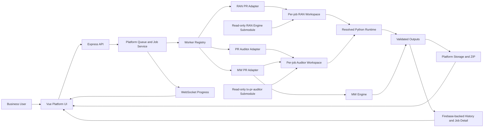

# AI Worker Platform

AI Worker Platform is an internal web platform for running approved business-domain workers through a shared, browser-based job lifecycle.

The current baseline provides three PR worker families:

| Worker | Worker ID | Business-rule owner | Current capability |
| --- | --- | --- | --- |
| MW PR Worker | `mw-pr` | `skills/create-pr-cd` | Existing MW TSS/TI PR and ECC workflow |
| RAN PR Worker | `ran-pr` | Pinned `skills/create-pr-cd-ran` submodule | Standard PR and General Item PR |
| PR Auditor | `pr-auditor` | Pinned `skills/tx-pr-auditor` submodule | Generate TSS/TI entitlement and audit Final PO submissions |

**Current merged baseline:** RAN PR Worker merged through PR #17 at `29cbd382c92222b4f555d1926f106e1c66837404`.

## What the Platform Owns

The platform owns the shared product and runtime responsibilities:

- Vue frontend, worker selection, uploads, live progress and download UX
- Express API, queue dispatch, cancellation and timeout lifecycle
- per-job workspaces, file metadata, ZIP packaging and output collection
- Firebase-backed job history, Job Detail and audit metadata
- WebSocket progress events
- safe user-facing errors, warnings and failure diagnosis
- controlled Python interpreter resolution and dependency preflight

Worker engines own their domain business rules, configurations, templates and input/output transformations. The platform must not duplicate or modify engine-owned rules.

## RAN PR Worker Baseline

The RAN engine is a read-only pinned Git submodule:

```text
skills/create-pr-cd-ran
v1.0.0
239910e2816153339a94881597bbb95355059741
```

RAN v1 supports:

- BOM upload and semantic BOM prevalidation
- EPMS upload
- Standard PR
- General Item PR, using a configuration-derived and backend-validated project selection
- isolated execution of normalize → calculation → PR generation → ECC export
- ECC output validation, ZIP download, History and Job Detail

RAN BOM Comparison is **not implemented**. It must not be presented as an available action, route or menu item.

### Lifecycle safeguards

The RAN integration protects against false success:

- wrong BOM structures are rejected before queueing
- placeholder, header-only and empty ECC workbooks are rejected
- invalid outputs do not contribute to output count or successful ZIP creation
- zero valid outputs become `failed`, unless cancellation semantics apply
- cancelled jobs with valid partial output become `cancelled_with_partial_result`
- RAN Python stages inherit the platform job timeout when no explicit valid timeout exists

## PR Auditor Baseline

The PR Auditor engine is a read-only pinned Git submodule:

```text
skills/tx-pr-auditor
approved-cba28b7
cba28b76716bf68f5fe8b03ac33c7e396c8935ee
```

A PR Auditor job accepts a Final PO workbook and EPMS workbook. The platform runs the approved engines in this order:

1. `create-pr-cd` generates isolated TSS and TI ECC entitlement from EPMS.
2. `tx-pr-auditor` compares Final PO rows only with those generated ECC workbooks.
3. The platform validates and tracks `PR_Audit_Result.xlsx` and the optional trusted summary JSON.

`tx-pr-auditor` must not read EPMS or PR Model directly. It owns downstream Final PO comparison, duplicate resolution and report generation; `create-pr-cd` remains the entitlement owner.

The runtime fails closed when the approved engine pin is missing or unverified. Jobs with error code `PR_AUDITOR_ENGINE_PIN_UNAPPROVED` show only this safe message across the live console, History, Job Detail and Re-Ask:

```text
PR Auditor runtime is blocked until a safe engine pin is approved and recorded.
```

Do not replace this condition with generic success, expose stderr or local paths, or mark an unverified engine revision as approved.

## Architecture



## Repository Layout

```text
ai-worker-platform/
├─ frontend/                    # Vue application
├─ backend/                     # Express API, queue, workers and services
├─ skills/
│  ├─ create-pr-cd/             # MW engine assets
│  └─ create-pr-cd-ran/         # Pinned RAN engine submodule (read-only)
├─ storage/                     # Platform runtime storage; generated content is untracked
├─ docs/                        # Current documentation, architecture and historical evidence
├─ requirements-worker.txt      # Shared Python runtime dependencies
└─ .env.example                 # Safe local configuration template
```

## Local Development (Windows)

The `skills/` directory includes the MW engine assets plus the pinned, read-only `create-pr-cd-ran` and `tx-pr-auditor` engine submodules.

### 1. Clone with worker engines

```powershell
git clone --recurse-submodules https://github.com/DemonTweeks/ai-worker-platform.git
cd ai-worker-platform
git submodule update --init --recursive
```

For an existing clone:

```powershell
git pull --ff-only origin main
git submodule sync --recursive
git submodule update --init --recursive
```

### 2. Configure local environment

```powershell
Copy-Item .env.example .env
@"
VITE_API_BASE_URL=http://127.0.0.1:8000
VITE_WS_URL=ws://127.0.0.1:8000/ws
"@ | Set-Content frontend\.env.local
```

Keep `.env`, `frontend/.env.local`, runtime workspaces and generated outputs untracked.

### 3. Create a deterministic Python runtime

```powershell
py -3 -m venv .venv
$python = (Resolve-Path .\.venv\Scripts\python.exe).Path
& $python -m pip install --upgrade pip
& $python -m pip install -r requirements-worker.txt
& $python -m pip install -r skills\create-pr-cd\requirements.txt
& $python -m pip install -r skills\tx-pr-auditor\requirements.txt
Add-Content .env ('PYTHON_EXECUTABLE="' + $python + '"')
```

The backend resolves Python in this order: `PYTHON_EXECUTABLE`, repository `.venv`, then a safely resolved system interpreter. Do not pass unresolvable bare commands into runtime execution.

### 4. Install and run Node services

```powershell
npm.cmd --prefix backend ci
npm.cmd --prefix frontend ci

npm.cmd --prefix backend run dev
npm.cmd --prefix frontend run dev
```

- Frontend: `http://localhost:3000`
- Backend health: `http://localhost:8000/health`

## Verification

Run the normal platform checks:

```powershell
npm.cmd --prefix backend test
npm.cmd --prefix frontend test
npm.cmd --prefix frontend run build
npm.cmd --prefix backend run test:preflight
git diff --check
```

Run the RAN-focused regression checks when RAN behavior, shared lifecycle services, Python execution or output handling changes:

```powershell
npm.cmd --prefix backend run test:ran-output-validation
npm.cmd --prefix backend run test:ran-placeholder-runtime
npm.cmd --prefix backend run test:ran-golden
npm.cmd --prefix backend run test:ran-history-reload
npm.cmd --prefix backend run test:ran-concurrency
npm.cmd --prefix backend run test:ran-invalid-safe-errors
npm.cmd --prefix backend run test:ran-worker-service
npm.cmd --prefix backend run test:ran-routes
```

Run the PR Auditor engine and platform regression checks when its pin, adapter, workspace, output handling or presentation changes:

```powershell
& .\.venv\Scripts\python.exe -m unittest discover -s skills\tx-pr-auditor\tests -p "test_*.py" -v
node backend\scripts\pr-auditor-adapter-test.js
node backend\scripts\pr-auditor-workspace-test.js
node backend\scripts\pr-auditor-output-ingestion-test.js
node backend\scripts\pr-auditor-worker-service-test.js
node backend\scripts\pr-auditor-summary-metadata-test.js
node backend\scripts\pr-auditor-route-test.js
node backend\scripts\pr-auditor-concurrency-test.js
node backend\scripts\error-visibility-test.js
```

Firebase-backed tests that share a test backend must run serially.

## Operational Rules

- Do not update the RAN submodule without explicit approval.
- Do not update or approve the `tx-pr-auditor` submodule without validating the exact revision and updating its manifest pin.
- Do not edit RAN business logic in `skills/create-pr-cd-ran` from the platform repository.
- Do not edit PR Auditor business logic in `skills/tx-pr-auditor` from the platform repository.
- Do not execute RAN jobs in the upstream fixed `input/` or `output/` folders.
- Do not execute PR Auditor jobs in the submodule's sample `input/` or `output/` folders; use isolated platform storage.
- Keep RAN workspaces isolated under platform-owned storage.
- Treat output validation, cancellation precedence, timeouts, safe errors and final-summary ordering as regression-sensitive lifecycle areas.
- Do not commit generated Excel files, ZIPs, Firebase exports, `.env` files or runtime workspaces.

## Documentation

Start with [docs/README.md](docs/README.md).

Current operational references:

- [Platform Architecture and Operating Baseline](docs/AI_Worker_Platform_Technical_Architecture_and_Business_Logic_Reference_v0.1.md)
- [RAN PR Worker Integration Technical Reference](docs/AI_Worker_Platform_RAN_PR_Worker_Integration_Technical_Reference.md)
- [Windows Local Development and Deployment Guide](docs/deployment-windows.md)
- [QA and UAT Checklist](docs/qa-checklist.md)

Historical project plans, autonomous-run logs, prior acceptance evidence and design records remain in `docs/` as evidence. They are not current operating instructions unless explicitly labeled as such.
