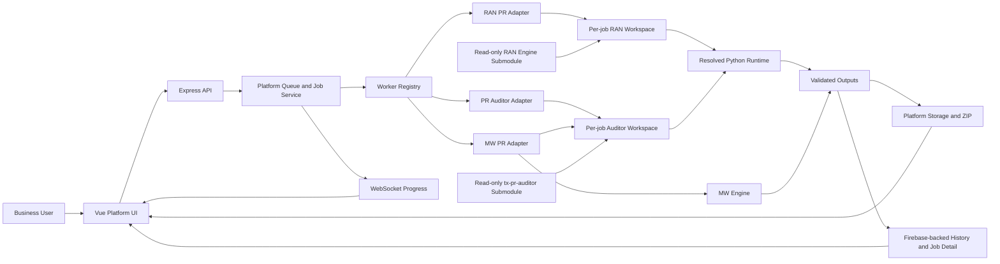

# AI Worker Platform

AI Worker Platform is an internal web platform for running approved business-domain workers through a shared, browser-based job lifecycle.

The current baseline provides three PR worker families:

| Worker | Worker ID | Business-rule owner | Current capability |
| --- | --- | --- | --- |
| MW PR Worker | `mw-pr` | `skills/create-pr-cd` | Existing MW TSS/TI PR and ECC workflow |
| RAN PR Worker | `ran-pr` | Pinned `skills/create-pr-cd-ran` submodule | Standard PR and General Item PR |
| PR Auditor | `pr-auditor` | Pinned `skills/tx-pr-auditor` submodule | Generate TSS/TI entitlement and audit Final PO submissions |

**Current merged baseline:** RAN PR Worker merged through PR #17 at `29cbd382c92222b4f555d1926f106e1c66837404`.

## What the Platform Owns

The platform owns the shared product and runtime responsibilities:

- Vue frontend, worker selection, uploads, live progress and download UX
- Express API, queue dispatch, cancellation and timeout lifecycle
- per-job workspaces, file metadata, ZIP packaging and output collection
- Firebase-backed job history, Job Detail and audit metadata
- WebSocket progress events
- safe user-facing errors, warnings and failure diagnosis
- controlled Python interpreter resolution and dependency preflight

Worker engines own their domain business rules, configurations, templates and input/output transformations. The platform must not duplicate or modify engine-owned rules.

## RAN PR Worker Baseline

The RAN engine is a read-only pinned Git submodule:

```text
skills/create-pr-cd-ran
v1.0.0
239910e2816153339a94881597bbb95355059741
```

RAN v1 supports:

- BOM upload and semantic BOM prevalidation
- EPMS upload
- Standard PR
- General Item PR, using a configuration-derived and backend-validated project selection
- isolated execution of normalize → calculation → PR generation → ECC export
- ECC output validation, ZIP download, History and Job Detail

RAN BOM Comparison is **not implemented**. It must not be presented as an available action, route or menu item.

### Lifecycle safeguards

The RAN integration protects against false success:

- wrong BOM structures are rejected before queueing
- placeholder, header-only and empty ECC workbooks are rejected
- invalid outputs do not contribute to output count or successful ZIP creation
- zero valid outputs become `failed`, unless cancellation semantics apply
- cancelled jobs with valid partial output become `cancelled_with_partial_result`
- RAN Python stages inherit the platform job timeout when no explicit valid timeout exists

## PR Auditor Baseline

The PR Auditor engine is a read-only pinned Git submodule:

```text
skills/tx-pr-auditor
approved-af33b5a
af33b5a795af02ae606b0d0f6e742cc09a8f98a2

skills/create-pr-cd
approved-6f0253e
6f0253edad2a4bb3abfef838e918379110bbd046
```

A PR Auditor job accepts a Final PO workbook and EPMS workbook. The platform runs the approved engines in this order:

1. `create-pr-cd` generates isolated TSS and TI ECC entitlement from EPMS.
2. `tx-pr-auditor` compares Final PO rows only with those generated ECC workbooks.
3. The platform validates and tracks `PR_Audit_Result.xlsx` and the optional trusted summary JSON.

`tx-pr-auditor` must not read EPMS or PR Model directly. It owns downstream Final PO comparison, duplicate resolution and report generation; `create-pr-cd` remains the entitlement owner.

The MW PR responsibility boundary is strict:

- `create-pr-cd` identifies the DU Profile from the original four-header export, maps exact source fingerprints into canonical fields, validates scope-required canonical evidence, and generates ECC through `scripts/create_pr.py`.
- `ai-worker-platform` uploads the source file, supplies only scope and site selection, invokes that official entrypoint, and collects its outputs or structured errors. It does not select source columns or DU Profiles.

Backend startup verifies the Git commit when repository metadata is available and always verifies a SHA-256 fingerprint of every approved runtime file. Startup fails closed when either engine differs from its approved pin. Jobs with error code `PR_AUDITOR_ENGINE_PIN_UNAPPROVED` show only this safe message across the live console, History, Job Detail and Re-Ask:

```text
PR Auditor runtime is blocked until a safe engine pin is approved and recorded.
```

Do not replace this condition with generic success, expose stderr or local paths, or mark an unverified engine revision as approved.

## Architecture


```mermaid
flowchart LR
  U[Business User] --> UI[Vue Platform UI]
  UI --> API[Express API]
  API --> Q[Platform Queue and Job Service]
  Q --> WR[Worker Registry]
  WR --> MW[MW PR Adapter]
  WR --> RAN[RAN PR Adapter]
  WR --> AUDIT[PR Auditor Adapter]
  MW --> MWE[MW Engine]
  RAN --> WS[Per-job RAN Workspace]
  AUDIT --> AWS[Per-job Auditor Workspace]
  RANEngine[Read-only RAN Engine Submodule] --> WS
  MW --> AWS
  AuditorEngine[Read-only tx-pr-auditor Submodule] --> AWS
  WS --> PY[Resolved Python Runtime]
  AWS --> PY
  PY --> OUT[Validated Outputs]
  MWE --> OUT
  OUT --> STORE[Platform Storage and ZIP]
  OUT --> HISTORY[Firebase-backed History and Job Detail]
  Q --> WSS[WebSocket Progress]
  WSS --> UI
  STORE --> UI
  HISTORY --> UI
```

## Repository Layout

```text
ai-worker-platform/
├─ frontend/                    # Vue application
├─ backend/                     # Express API, queue, workers and services
├─ skills/
│  ├─ create-pr-cd/             # MW engine assets
│  ├─ create-pr-cd-ran/         # Pinned RAN engine submodule (read-only)
│  └─ tx-pr-auditor/            # Pinned PR Auditor engine submodule (read-only)
├─ storage/                     # Platform runtime storage; generated content is untracked
├─ wiki/                        # Current analysis, handover and remediation plan
├─ requirements-worker.txt      # Shared Python runtime dependencies
└─ config/env/                 # Central local/production environment templates
```

## Runtime Profiles

`main` is the only application branch needed for runtime use. Environment selection is a launch-time concern:

- `local` runs the hash-routed Vite UI at `/` and the backend directly on ports 3000/8000; Nginx is not involved.
- `production` builds the same hash-routed UI under `/fe/`, runs hidden backend/preview processes, and expects Nginx to proxy the frontend plus same-origin HTTP and WebSocket traffic.

All backend and frontend variables live together under `config/env/`. See [config/env/README.md](config/env/README.md).

## Local Development (Windows)

The `skills/` directory includes the MW engine assets plus the pinned, read-only `create-pr-cd-ran` and `tx-pr-auditor` engine submodules.

### 1. Clone with worker engines

```powershell
git clone --recurse-submodules https://github.com/DemonTweeks/ai-worker-platform.git
cd ai-worker-platform
git submodule update --init --recursive
```

For an existing clone:

```powershell
git pull --ff-only origin main
git submodule sync --recursive
git submodule update --init --recursive
```

### 2. Configure the centralized local environment

```powershell
Copy-Item config\env\local.env.example config\env\local.env
```

Keep `config/env/*.env`, runtime workspaces, logs, and generated outputs untracked.

### 3. Create a deterministic Python runtime

```powershell
py -3 -m venv .venv
$python = (Resolve-Path .\.venv\Scripts\python.exe).Path
& $python -m pip install --upgrade pip
& $python -m pip install -r requirements-worker.txt
& $python -m pip install -r skills\create-pr-cd\requirements.txt
& $python -m pip install -r skills\tx-pr-auditor\requirements.txt
# Set PYTHON_EXECUTABLE in config\env\local.env to the resolved path.
```

The backend resolves Python in this order: `PYTHON_EXECUTABLE`, repository `.venv`, then a safely resolved system interpreter. Do not pass unresolvable bare commands into runtime execution.

### 4. Install and run locally

```powershell
$env:AI_WORKER_PROFILE = 'local'
npm.cmd --prefix backend ci
npm.cmd --prefix frontend ci
# Run these in separate terminals:
npm.cmd --prefix backend run dev
npm.cmd --prefix frontend run dev
```

- Frontend: `http://localhost:3000`
- Backend health: `http://localhost:8000/api/health`

Local development does not use the production launcher or Nginx. Use `.\stop-services.ps1` to stop listeners on the configured frontend/backend ports.

## Production Launch

Production uses the same `main` checkout; it never switches to an environment branch.

```powershell
Copy-Item config\env\production.env.example config\env\production.env
# Set a stable AI_WORKER_MACHINE_ID and all required credentials in production.env.
.\launcher.ps1 -InstallDependencies
```

Configure the host Nginx installation with `frontend/nginx.conf`, then open `/fe/`. The Admin deployment handoff always relaunches the `production` profile from the current checkout. Live keys and passwords must remain only in ignored `config/env/production.env` or an external secret-injection mechanism.

## Verification

Run the normal platform checks:

```powershell
npm.cmd --prefix backend test
npm.cmd --prefix frontend test
npm.cmd --prefix frontend run build
npm.cmd --prefix backend run test:preflight
git diff --check
```

Run the RAN-focused regression checks when RAN behavior, shared lifecycle services, Python execution or output handling changes:

```powershell
npm.cmd --prefix backend run test:ran-output-validation
npm.cmd --prefix backend run test:ran-placeholder-runtime
npm.cmd --prefix backend run test:ran-golden
npm.cmd --prefix backend run test:ran-history-reload
npm.cmd --prefix backend run test:ran-concurrency
npm.cmd --prefix backend run test:ran-invalid-safe-errors
npm.cmd --prefix backend run test:ran-worker-service
npm.cmd --prefix backend run test:ran-routes
```

Run the PR Auditor engine and platform regression checks when its pin, adapter, workspace, output handling or presentation changes:

```powershell
& .\.venv\Scripts\python.exe -m unittest discover -s skills\tx-pr-auditor\tests -p "test_*.py" -v
node backend\scripts\pr-auditor-adapter-test.js
node backend\scripts\pr-auditor-workspace-test.js
node backend\scripts\pr-auditor-output-ingestion-test.js
node backend\scripts\pr-auditor-worker-service-test.js
node backend\scripts\pr-auditor-summary-metadata-test.js
node backend\scripts\pr-auditor-route-test.js
node backend\scripts\pr-auditor-concurrency-test.js
node backend\scripts\error-visibility-test.js
```

Firebase-backed tests that share a test backend must run serially.

## Operational Rules

- Do not update the RAN submodule without explicit approval.
- Do not update or approve the `tx-pr-auditor` submodule without validating the exact revision and updating its manifest pin.
- Do not edit RAN business logic in `skills/create-pr-cd-ran` from the platform repository.
- Do not edit PR Auditor business logic in `skills/tx-pr-auditor` from the platform repository.
- Do not execute RAN jobs in the upstream fixed `input/` or `output/` folders.
- Do not execute PR Auditor jobs in the submodule's sample `input/` or `output/` folders; use isolated platform storage.
- Keep RAN workspaces isolated under platform-owned storage.
- Treat output validation, cancellation precedence, timeouts, safe errors and final-summary ordering as regression-sensitive lifecycle areas.
- Do not commit generated Excel files, ZIPs, Firebase exports, `.env` files or runtime workspaces.

## Documentation

Start with [wiki/SUMMARIZE.md](wiki/SUMMARIZE.md).

Current operational references:

- [Platform Architecture](wiki/ARCHITECTURE.md)
- [Skill Integration Contract](wiki/SKILL_CONTRACT.md)
- [Pending Architecture Items](wiki/PENDING.md)
- [Analysis Summary](wiki/SUMMARIZE.md)
- [Implementation Handover](wiki/HANDOVER.md)
- [Overall Remediation Plan](wiki/PLAN.md)
