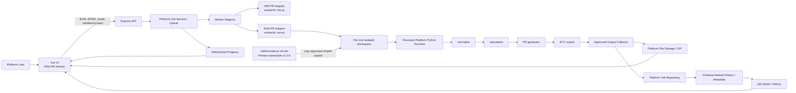

# AI Worker Platform × RAN PR Worker Integration
## Technical Architecture Baseline and Integration Reference

**Document status:** Approved architecture baseline  
**Implementation status:** In progress — autonomous Phase 0 initialized  
**Date:** 25 June 2026  
**Platform repository:** `DemonTweeks/ai-worker-platform`  
**Integration branch:** `feature/ran-pr-worker-integration`  
**Integration worktree:** `C:\dev\ai-worker-platform-ran-pr`  
**RAN engine repository:** `ammarofficial11/create-pr-cd-ran`  
**Pinned RAN engine version:** `v1.0.0`  
**Pinned resolved engine commit:** `239910e2816153339a94881597bbb95355059741`

---

## 1. Purpose

This document is the long-term technical reference for integrating the RAN PR capability into AI Worker Platform.

It defines the target architecture, ownership boundaries, execution contract, security rules, verification model, and upgrade governance. It is intentionally independent of any one implementation session so that future developers can understand and safely extend the RAN PR Worker without rediscovering the original decisions.

The target outcome is not a second RAN application. It is a platform-native RAN Worker Skill that uses the RAN team’s Python engine while inheriting the AI Worker Platform's standard job lifecycle, persistence, history, downloads, error controls, and UI standards.

---

## 2. Design Goals

### 2.1 Primary goals

1. Add RAN PR creation as a second approved Worker Skill alongside the existing MW PR capability.
2. Preserve the RAN upstream repository as the source of truth for RAN business rules, configuration, templates, and golden reference data.
3. Keep AI Worker Platform as the owner of all product/runtime responsibilities:
   - Vue user interface
   - Express API
   - job lifecycle
   - queue and cancellation
   - job records and history
   - Firebase-backed persistence and file metadata
   - WebSocket progress
   - downloads and ZIP lifecycle
   - Job Detail
   - warnings, review-required items, and auditability
   - safe user-facing errors
4. Ensure simultaneous RAN jobs do not share runtime inputs or outputs.
5. Make RAN engine version and commit traceable for every job.
6. Establish a controlled upgrade process rather than following RAN upstream `main`.

### 2.2 Non-goals

This integration does not:

- merge Git histories;
- copy the entire RAN repository into the platform;
- replace existing MW business rules;
- create separate RAN persistence, history, or job tracking;
- reuse the RAN prototype UI, FastAPI server, or standalone routes;
- implement BOM Comparison in RAN v1;
- permit automatic merge or deployment.

---

## 3. Repository Topology and Ownership

| Component | Repository / Location | Ownership | Responsibility |
|---|---|---|---|
| AI Worker Platform | `DemonTweeks/ai-worker-platform` | Platform team | Product runtime, UI, API, job lifecycle, persistence, worker registry, history, downloads, ZIP, safe errors |
| MW PR engine | `skills/create-pr-cd/` | Existing MW owner | MW business rules and engine assets |
| RAN PR engine | `skills/create-pr-cd-ran/` Git submodule | RAN upstream team | RAN Python business rules, configurations, templates, samples, golden references |
| Autonomous methodology | `Gumb-D/codex-unattended-development` | Methodology reference | Controlled autonomous development process only; never a runtime dependency |

### 3.1 Submodule policy

The RAN engine is integrated through a pinned Git submodule:

```text
skills/create-pr-cd-ran
```

The submodule must be checked out at upstream tag `v1.0.0`, resolving to:

```text
239910e2816153339a94881597bbb95355059741
```

The platform records the resulting Gitlink SHA in its own repository. This makes the RAN engine release reproducible without duplicating upstream source.

### 3.2 Submodule rules

Allowed:

- add `.gitmodules`;
- add/update the RAN submodule pointer;
- inspect submodule source and samples;
- copy approved assets from the submodule into an isolated runtime workspace.

Forbidden:

- edit any RAN business-rule source inside the submodule;
- commit generated outputs under the submodule;
- update automatically to upstream `main`;
- use upstream fixed `input/` or `output/` as shared runtime folders.

---

## 4. Target Architecture



### 4.1 Ownership boundary

The platform backend owns all persistence. Python engines never write directly to Firebase, MongoDB, or any platform job store.

The RAN engine receives only validated job input placed in a temporary job workspace and returns only controlled output files and structured execution results. The adapter converts those results into platform records and user-safe status.

---

## 5. Worker Skill Contract

Every approved Worker Skill must contain four logical layers.

### 5.1 Engine

The engine owns domain business logic:

- Python scripts;
- configuration;
- templates;
- reference assets;
- domain-specific input/output transformations.

For RAN v1, the engine stages are:

```text
src/simple_normalize.py
src/simple_calculation.py
src/simple_pr_generator.py
src/simple_ecc_export.py
```

### 5.2 Manifest

The manifest is the machine-readable contract between engine and platform.

Minimum RAN semantic content:

```json
{
  "workerId": "ran-pr",
  "displayName": "RAN PR Worker",
  "engineRepository": "ammarofficial11/create-pr-cd-ran",
  "engineVersion": "v1.0.0",
  "engineCommit": "239910e2816153339a94881597bbb95355059741",
  "capabilities": [
    "standard-pr",
    "general-item"
  ],
  "notImplemented": [
    "bom-comparison"
  ],
  "compatibilityStatus": "verified"
}
```

The final manifest schema may include inputs, outputs, validation rules, runtime dependencies, limitations, or capabilities. It must retain the semantics above.

### 5.3 Platform Adapter

The adapter translates platform jobs into engine execution.

The RAN adapter must own:

- BOM and EPMS input mapping;
- file type and required-field validation;
- validated General Item project selection;
- per-job workspace creation;
- explicit Python runtime selection;
- engine stage orchestration;
- progress mapping;
- cancellation integration;
- output collection;
- safe failure conversion;
- engine version/commit audit metadata.

### 5.4 Worker Registry

The Worker Registry is the platform-controlled allowlist for runnable worker skills.

Required logical workers:

| Worker ID | Purpose | Compatibility requirement |
|---|---|---|
| `mw-pr` | Existing MW PR capability | Existing routes, UX, history, outputs, and external behavior remain compatible |
| `ran-pr` | New RAN PR capability | Platform-native implementation using RAN engine submodule |

Legacy identifiers may remain internally where required for compatibility, but new logic should resolve through the registry rather than scattered worker-specific branching.

---

## 6. RAN v1 Functional Scope

### 6.1 Included

- Standard PR
- General Item PR
- BOM upload
- EPMS upload
- configuration-derived and validated General Item project selection
- platform job creation
- queue dispatch
- progress and status
- job history and Job Detail
- ECC output collection
- ZIP package download
- safe error visibility
- engine version and SHA audit metadata

### 6.2 Explicitly deferred

```text
BOM Comparison
```

BOM Comparison must not have:

- a UI button;
- an API route;
- a navigation entry;
- an action menu item;
- wording that implies functional availability.

Where disclosure is needed, it must be shown only as `Not implemented — future scope`.

---

## 7. Isolated RAN Execution Model

### 7.1 Why isolation is mandatory

The RAN upstream repository uses shared fixed `input/` and `output/` folders. Running platform jobs directly against these folders risks:

- job-to-job file contamination;
- incorrect output collection;
- concurrency conflicts;
- stale output appearing in new jobs;
- accidental modification of source samples;
- unreliable audit evidence.

### 7.2 Required per-job execution flow

For every RAN job:

1. The platform assigns a unique platform job ID.
2. The RAN adapter creates a dedicated workspace under a platform-controlled temporary or job storage root.
3. The adapter copies only required engine assets from the pinned submodule:
   - `src/`
   - `config/`
   - templates/reference assets proven necessary by compatibility testing.
4. The adapter copies only the current user BOM and EPMS uploads into the workspace.
5. The adapter sets the workspace as current working directory.
6. The adapter runs the validated Python stages in prescribed order.
7. The adapter collects approved output files only.
8. The platform persists output metadata, warnings, review-required items, and audit metadata.
9. The platform creates a ZIP package using its existing lifecycle.
10. Workspace cleanup follows platform retention rules.

### 7.3 Runtime restrictions

Do not use as runtime assets:

```text
api/
web/
build/
dist/
launcher.py
launcher.exe
upstream fixed input/
upstream fixed output/
.env
node_modules
generated files
```

Do not run with `shell: true`.

Do not invoke bare `python` or `python3`; use the platform’s deterministic Python resolution and dependency-preflight mechanism.

---

## 8. Input and Validation Contract

### 8.1 Required inputs

| Input | Required | Validation responsibility |
|---|---:|---|
| BOM file | Yes | Platform adapter |
| EPMS file | Yes | Platform adapter |
| PR mode | Yes | Platform UI/API |
| General Item project | Only in General Item mode | Derived and validated from upstream configuration |

### 8.2 Project selection

The platform must derive valid General Item project values from upstream RAN configuration or a controlled platform mapping backed by it.

The UI may present only validated values. The backend must independently revalidate the submitted value. Arbitrary user strings must never be passed to a subprocess argument list.

### 8.3 Validation failure

Input failures must be represented through the platform job/error model, with user-safe text that explains what is missing or invalid without exposing raw paths, commands, or confidential payloads.

---

## 9. Job Lifecycle, Persistence, and Auditability

### 9.1 Unified lifecycle

RAN jobs must use the same platform lifecycle model as MW jobs:

```text
created
→ validated
→ queued
→ running
→ completed | failed | cancelled
```

The exact existing platform status names should be preserved where they differ. The RAN adapter must fit into the actual current job service rather than introducing a competing state machine.

### 9.2 Persistence rules

RAN uses the existing platform mechanisms for:

- job records;
- Firebase-backed history and metadata;
- file metadata;
- warnings;
- review-required items;
- audit trail;
- WebSocket status;
- Job Detail;
- download links;
- ZIP lifecycle;
- safe failure presentation.

No separate RAN tree, database, page, or job ID system may be introduced.

### 9.3 Per-job audit metadata

Every RAN job should retain at least:

- worker ID;
- display identity;
- engine repository;
- engine tag/version;
- pinned commit SHA;
- selected mode;
- validated project value where relevant;
- input metadata;
- output metadata;
- created/started/completed timestamps;
- status;
- warnings and review-required items where available.

---

## 10. Safe Error Model

The platform’s Issue #4 error-visibility model is mandatory for RAN integration.

User-facing Job Detail and History may show allow-listed information such as:

- safe failure category;
- concise failure summary;
- validated missing dependency name;
- safe repair command when appropriate;
- resolved interpreter identity where safely allowed;
- bounded, redacted technical details;
- valid business scope or mode.

The platform must never expose:

- raw stderr or stdout by default;
- raw command line;
- command arguments;
- uploaded file paths;
- workspace paths;
- environment values;
- API keys, tokens, passwords, authorization headers, or secrets;
- arbitrary raw error messages.

All redaction, truncation, safe-category mapping, and frontend rendering should reuse or extend the existing platform-safe error policy rather than create a RAN-only exception.

---

## 11. Frontend Integration Standard

The RAN frontend is a platform-native Vue experience, not a reuse of the upstream prototype.

Required experience:

1. RAN PR Worker entry point.
2. BOM upload.
3. EPMS upload.
4. Standard PR selection.
5. General Item project selection when applicable.
6. Submit/create job action.
7. Live progress/status.
8. Output downloads.
9. ZIP package download.
10. History worker identity, badge, and filtering.
11. Job Detail with:
    - RAN Worker identity;
    - engine version and SHA;
    - RAN-safe details;
    - warnings/review-required items;
    - safe failure diagnosis.

UI wording must clearly state BOM Comparison as future/not implemented if the subject appears.

---

## 12. Golden Verification Strategy

### 12.1 Approved golden reference assets

The upstream RAN repository contains approved sample/reference data, including:

```text
input/EPMS.xlsx
associated BOM sample
output/ECC_PR_Output.xlsx
output/ECC_PR_Output_With_GeneralItems.xlsx
```

`EPMS.xlsx` is a regression sample only. Real jobs must always use the current platform user upload.

### 12.2 Logical workbook comparison

XLSX files must not be compared as raw binary data because equivalent Excel content can produce different binary metadata.

Golden tests must compare logical content such as:

- sheet names;
- required columns;
- row counts;
- PR items;
- materials;
- quantities;
- key metadata;
- key summaries;
- General Item presence/absence;
- General Item values.

### 12.3 Required test evidence

| Test | Purpose |
|---|---|
| Standard PR golden test | Confirms normal RAN output matches reference business content |
| General Item golden test | Confirms General Item scenario and validated project handling |
| Workspace isolation/concurrency test | Proves jobs cannot contaminate shared input/output folders |
| Invalid input / safe error test | Confirms validation and safe failure conversion |
| MW regression | Confirms registry introduction did not break existing MW PR workflow |
| Backend test suite | Validates platform service/API behavior |
| Frontend test suite | Validates platform-native RAN UI behavior |
| Frontend build | Validates production bundling |
| History persistence/reload proof | Confirms real platform record/history behavior |
| Changed-file review | Controls scope and detects accidental generated assets |
| `git diff --check` | Detects whitespace errors |
| Submodule pin check | Confirms exact engine source version |

---

## 13. Controlled RAN Upgrade Governance

The platform must never follow upstream `main` automatically.

The mandatory RAN engine upgrade path is:

```text
RAN upstream update
→ upstream tag created
→ AI Worker Platform upgrade branch
→ submodule SHA/tag updated
→ RAN golden tests
→ MW regression
→ human business confirmation
→ merge platform PR
```

### 13.1 Upgrade runbook requirements

Every upgrade must:

1. identify the upstream tag and resolved commit;
2. use a dedicated platform upgrade branch;
3. update only the submodule pointer and required compatibility code;
4. run both RAN golden test modes;
5. run workspace isolation testing;
6. run MW regression;
7. document changed RAN capability/limitations;
8. obtain human business confirmation before merge.

An upstream business-rule change that requires modifications inside the RAN submodule is outside the platform integration scope. It must be handled and tagged upstream first.

---

## 14. Delivery and Acceptance Rules

### 14.1 Autonomous implementation controls

The integration is developed through a controlled autonomous workflow:

```text
Mission
→ /goal
→ hourly heartbeat
→ read Master Prompt fresh
→ read persistent state
→ one bounded implementation step
→ verify
→ update logs/state
→ Git checkpoint
→ repeat
→ final gates
→ Draft PR
→ human review
```

The persistent state directory is:

```text
docs/ran-pr-worker-integration/
```

### 14.2 Draft PR only

The autonomous run may:

- create worktree;
- modify scoped code;
- run tests;
- create checkpoint commits;
- push the feature branch;
- create a Draft PR.

It must not:

- merge;
- deploy;
- push `main`;
- change upstream RAN business-rule source;
- commit generated or sensitive artifacts.

### 14.3 Completion criteria

The integration is complete only after all required verification gates pass, the final report is written, `COMPLETED` is created, state records `completed=true`, and the feature worktree is clean after final checkpoint.

---

## 15. Current Execution Snapshot

At document creation:

| Item | Status |
|---|---|
| Platform baseline | `a2d51d5` — merged Issue #4 safe error visibility |
| RAN upstream tag | Remote `v1.0.0` available |
| RAN resolved commit | `239910e2816153339a94881597bbb95355059741` |
| Feature branch | `feature/ran-pr-worker-integration` |
| Feature worktree | `C:\dev\ai-worker-platform-ran-pr` |
| Autonomous mission | Active `/goal` with hourly heartbeat |
| First checkpoint | `3ff6d9a` — mission state initialized |
| Current phase | Phase 0 discovery |
| `COMPLETED` marker | Not created |

This snapshot is operational context, not a substitute for the current mission state files.

---

## 16. Key Risks and Controls

| Risk | Control |
|---|---|
| RAN jobs share fixed upstream folders | Per-job isolated workspaces |
| Upstream changes silently affect platform | Pin submodule tag and SHA |
| Engine business rules are altered by platform | No submodule edits |
| RAN creates separate persistence lifecycle | Platform backend exclusively owns persistence |
| Unsafe raw errors expose data | Reuse existing safe error policy |
| Arbitrary General Item values reach subprocess | Configuration-derived allowlist and backend validation |
| Registry refactor breaks MW | MW compatibility adapter and regression test |
| Excel binary comparison gives false mismatches | Logical workbook comparison |
| Autonomous work drifts or restarts | Master Prompt + persistent state + same `/goal` + bounded steps |
| Heartbeat runs after completion | `NO_OP_COMPLETED`, then manually pause/disable heartbeat |
| RAN upgrade causes unverified drift | Dedicated upgrade branch, golden tests, MW regression, human confirmation |

---

## 17. Reference Implementation Checklist

Before considering RAN PR Worker ready for human review, confirm:

```text
[ ] RAN submodule exists at skills/create-pr-cd-ran
[ ] Submodule resolves to v1.0.0 / 239910e...
[ ] No submodule source changes
[ ] Worker Registry exists
[ ] MW compatibility behavior is protected
[ ] RAN manifest exists and records capabilities/limitations
[ ] Per-job workspace is proven isolated
[ ] Standard PR works non-interactively
[ ] General Item works only with validated project values
[ ] BOM Comparison remains unavailable
[ ] Platform lifecycle, history, Firebase/file metadata, Job Detail, downloads, ZIP, and WebSocket are reused
[ ] RAN job stores engine version and SHA
[ ] Safe error rules are enforced
[ ] Golden tests pass
[ ] MW regression passes
[ ] Backend tests pass
[ ] Frontend tests and build pass
[ ] History persistence/reload proof exists
[ ] Final report and verification log are complete
[ ] Draft PR exists; no merge or deployment has occurred
```

---

## 18. Final Position

The RAN PR Worker is a controlled platform extension, not an embedded copy of another application.

The RAN team owns RAN business logic and releases. AI Worker Platform owns orchestration, safety, user experience, persistence, auditability, and delivery lifecycle. The pinned submodule plus worker registry/manifest/adapter pattern provides the required separation of ownership while enabling reusable Worker Skill expansion for future AI Worker capabilities.
