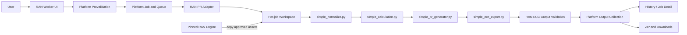

# AI Worker Platform × RAN PR Worker Integration

## Completed Technical Reference

**Status:** Implemented and merged  
**Platform baseline:** `main` commit `29cbd382c92222b4f555d1926f106e1c66837404`  
**Merged pull request:** PR #17 — `[codex] Integrate RAN PR Worker into AI Worker Platform`  
**Closed defect:** Issue #18 — RAN wrong BOM can return placeholder ECC output  
**RAN engine:** `ammarofficial11/create-pr-cd-ran`  
**Pinned engine version:** `v1.0.0`  
**Pinned engine commit:** `239910e2816153339a94881597bbb95355059741`

## 1. Purpose

RAN PR Worker is a platform-native worker skill. It does not embed the RAN prototype application, FastAPI server or standalone UI. The platform invokes the RAN Python engine through a platform-owned adapter while preserving the engine as the source of truth for RAN business rules.

This document is the RAN-specific maintenance reference. For cross-platform rules, use the [Platform Architecture and Operating Baseline](AI_Worker_Platform_Technical_Architecture_and_Business_Logic_Reference_v0.1.md).

## 2. Ownership Model

| Area | Owner |
| --- | --- |
| RAN calculation logic, configuration, templates, reference data and sample assets | Pinned RAN engine submodule |
| Worker registration, UI, API, job lifecycle, history, storage, ZIP, workspace isolation, safe errors, timeout and cancellation | AI Worker Platform |

The RAN submodule is read-only during platform runtime and must not be changed in the platform repository without explicit approval.

```text
skills/create-pr-cd-ran
```

## 3. Delivered Scope

### Available

- Standard PR
- General Item PR
- BOM and EPMS uploads
- configuration-derived General Item project catalog and backend validation
- shared platform queue, progress, cancellation, Job Detail and History
- isolated RAN job workspace
- ECC output collection and ZIP download
- engine version and commit audit metadata
- safe failures and preflight diagnosis

### Not implemented

```text
BOM Comparison
```

Do not add a UI control, route, menu item or wording that implies BOM Comparison is available.

## 4. RAN Job Flow



The RAN engine stages are:

```text
src/simple_normalize.py
src/simple_calculation.py
src/simple_pr_generator.py
src/simple_ecc_export.py
```

## 5. Input Contract

| Input | Required | Platform control |
| --- | ---:| --- |
| BOM workbook | Yes | readability checks and semantic RAN BOM validation |
| EPMS workbook | Yes | file/readability validation |
| Mode | Yes | Standard PR or General Item PR only |
| General Item project | General Item only | derived from engine-backed catalog and backend revalidated |

Arbitrary project values must never reach a subprocess argument list.

### RAN BOM semantic contract for engine v1.0.0

The platform validator mirrors the pinned engine behavior:

- first worksheet
- BOM header row 3
- site code, site name, region and DU code detection
- equipment columns derived from `MainConfig.xlsx` normalization mapping

This is correct for the pinned version. An engine upgrade must review this contract and should move sheet selection, header row, required business fields and meaningful-row rules into an engine-owned contract artifact.

## 6. Mandatory Isolation Rules

Each RAN job uses a unique platform-owned workspace. The upstream submodule is never a shared writable input/output location.

Do not execute platform jobs directly in, or copy runtime assets from:

```text
upstream input/
upstream output/
api/
web/
build/
dist/
launcher.py
launcher.exe
.env
node_modules
```

`storage/ran-workspaces/` and all generated Excel, ZIP and runtime artifacts must remain untracked.

## 7. False-Success Prevention

### Original defect

A wrong workbook uploaded into the RAN BOM slot could pass basic readability checks, produce placeholder ECC workbooks, show a completed job and create a downloadable ZIP.

### Implemented controls

1. **Semantic BOM prevalidation** rejects workbooks that do not match required RAN BOM structure before queueing.
2. **ECC output validation** checks expected worksheet and exact header structure; it rejects empty files, header-only files, one-cell placeholders and outputs without meaningful ECC rows.
3. **Output lifecycle protection** excludes invalid output from tracked files, `outputFileCount` and ZIP creation.
4. **Terminal status rules** apply:

| Condition | Terminal result |
| --- | --- |
| Not cancelled, zero valid ECC outputs | `failed` |
| Cancelled, zero valid outputs | `cancelled` |
| Cancelled, valid partial outputs | `cancelled_with_partial_result` |

5. **Summary ordering** writes final `Summary.json` only after terminal status has been persisted.

## 8. Runtime Reliability Rules

### Timeout

Every RAN Python pipeline stage receives:

```js
config.limits.jobTimeoutMinutes * 60 * 1000
```

when no valid explicit timeout is provided.

### Python interpreter resolution

Supported forms:

- valid absolute Python interpreter paths
- repository-relative paths only when they resolve to an existing file inside the repository root
- PATH fallback using `where.exe` on Windows or `which` on Linux/macOS

Unresolved bare commands must be rejected and never passed to `spawn()`.

### Cancellation precedence

Cancellation is evaluated before zero-output validation finalization. A user-cancelled job cannot be persisted as `failed` only because it generated no valid output.

## 9. Safe Failure Model

RAN reuses the platform safe-error policy. The UI may show allow-listed facts such as failure category, concise summary, validated dependency name, safe repair command, safely allowed interpreter identity and bounded redacted technical detail.

The UI must not expose raw stderr/stdout, raw command line, arguments, workspace paths, uploaded file paths, environment values, secrets, tokens or credentials.

## 10. Key Implementation Areas

```text
backend/src/workers/adapters/ranPrAdapter.js
backend/src/services/ranWorkerService.js
backend/src/services/childProcessRunner.js
backend/src/services/prevalidationService.js
backend/src/workers/ranBomValidationService.js
backend/src/workers/ranEccOutputValidationService.js
backend/src/workers/ranOutputIngestionService.js
backend/src/workers/ranWorkspaceService.js
backend/src/services/outputCollector.js
backend/src/services/jobService.js
```

## 11. Verified Baseline

Manual UAT completed before merge:

1. Wrong EPMS-as-BOM upload blocked before queueing with RAN BOM structure validation failure.
2. Valid RAN Standard run completed and produced usable ZIP output.
3. Valid RAN General Item run completed and produced usable ZIP output.
4. Existing MW TI smoke for site `7312B_HU` passed.

Focused regression commands:

```powershell
npm.cmd --prefix backend test
npm.cmd --prefix frontend test
npm.cmd --prefix frontend run build
npm.cmd --prefix backend run test:ran-output-validation
npm.cmd --prefix backend run test:ran-placeholder-runtime
npm.cmd --prefix backend run test:ran-golden
npm.cmd --prefix backend run test:ran-history-reload
npm.cmd --prefix backend run test:ran-concurrency
npm.cmd --prefix backend run test:ran-invalid-safe-errors
npm.cmd --prefix backend run test:ran-worker-service
npm.cmd --prefix backend run test:ran-routes
npm.cmd --prefix backend run test:preflight
git diff --check
```

Firebase-backed tests that share a test backend must run serially.

## 12. Maintenance and Upgrade Rules

- Do not update the RAN submodule automatically or follow upstream `main`.
- Do not modify engine business logic in the platform repository.
- Upgrade only from a tagged upstream release through a dedicated platform upgrade branch.
- Before adoption, run RAN Standard and General Item golden tests, workspace/concurrency tests, safe-error tests and MW regression.
- Record the upstream tag and resolved commit in the worker manifest and job metadata.
- Verify every review finding against the current head before resolving it; a later broad review does not invalidate a specific confirmed finding.

## 13. Historical Evidence

Completed autonomous-run state, execution plan, verification log, golden-test evidence and review records are retained in `docs/ran-pr-worker-integration/`. They record delivery evidence and should not be rewritten as current operating instructions.
