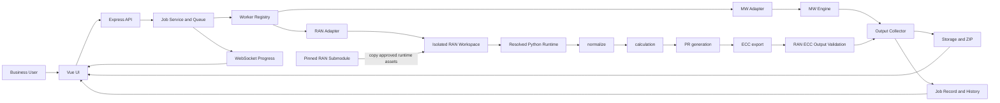

# AI Worker Platform — Technical Architecture and Operating Baseline

**Status:** Current operating reference  
**Revised:** 29 June 2026  
**Applies to:** `main` at and after `29cbd382c92222b4f555d1926f106e1c66837404`  
**Supersedes as current guidance:** pre-RAN Phase 0 design assumptions in this file

## 1. Purpose

AI Worker Platform is the product/runtime layer for approved domain workers. It provides one standard job lifecycle, user experience, safety boundary and evidence model while retaining domain business rules in engine-owned skills.

This document records the current architecture after RAN PR Worker integration. It is operating guidance, not an implementation plan.

## 2. Current Worker Inventory

| Worker | ID | Engine location | Supported scope |
| --- | --- | --- | --- |
| MW PR Worker | `mw-pr` | `skills/create-pr-cd` | Existing MW PR/ECC workflow |
| RAN PR Worker | `ran-pr` | `skills/create-pr-cd-ran` | Standard PR and General Item PR |

The RAN submodule is pinned at:

```text
v1.0.0
239910e2816153339a94881597bbb95355059741
```

RAN BOM Comparison is not implemented. Do not expose it as a selectable product capability.

## 3. Ownership Boundary

### Platform-owned

- Vue UI, worker selection, form controls and browser-side presentation
- Express API, job creation, queue dispatch, timeout and cancellation lifecycle
- Worker Registry, manifests and adapter dispatch
- per-job workspaces and controlled engine asset copy
- input metadata, output collection, file storage, ZIP packaging and download links
- Firebase-backed job history, Job Detail, audit metadata and WebSocket progress
- safe error classification, redaction and bounded technical details
- Python interpreter resolution and dependency preflight

### Engine-owned

- business rules and calculation logic
- templates, configuration and reference data
- engine-specific input and output transformations
- upstream releases and compatibility tags

The platform must not edit business-rule source inside `skills/create-pr-cd-ran`. RAN engine changes must be performed upstream, tagged, then adopted through a controlled submodule upgrade.

## 4. Runtime Architecture



## 5. Worker Contract

Each approved worker has four layers:

1. **Engine** — domain business rules, configuration, templates and reference assets.
2. **Manifest** — worker identity, capabilities, limitations and engine provenance.
3. **Platform Adapter** — input mapping, validation, workspace, execution, cancellation, output collection and safe error conversion.
4. **Registry Entry** — platform allowlist and dispatch mapping.

Relevant implementation areas:

```text
backend/src/workers/workerRegistry.js
backend/src/workers/workerTypes.js
backend/src/workers/manifests/mwPrManifest.js
backend/src/workers/manifests/ranPrManifest.js
backend/src/workers/adapters/mwPrAdapter.js
backend/src/workers/adapters/ranPrAdapter.js
backend/src/services/ranWorkerService.js
backend/src/services/childProcessRunner.js
backend/src/services/jobService.js
```

## 6. Shared Job Lifecycle

The platform is authoritative for job status and finalization. RAN must use the same job service, history, download and WebSocket lifecycle as MW.

```text
created → validated → queued → running
                         ├─ completed
                         ├─ failed
                         ├─ cancelled
                         └─ cancelled_with_partial_result
```

Rules:

- the platform, not the Python engine, persists job records
- a summary is written only after terminal status is persisted
- cancellation takes precedence over zero-output validation failure
- invalid files are not counted as outputs
- only valid outputs may appear in tracked files or successful ZIP packages

## 7. RAN Execution Contract

### Inputs

| Input | Required | Control |
| --- | ---:| --- |
| BOM workbook | Yes | semantic RAN BOM validation before queueing |
| EPMS workbook | Yes | platform file/readability validation |
| PR mode | Yes | allowlisted Standard or General Item mode |
| General Item project | General Item only | configuration-derived catalog and backend validation |

### Engine stages

```text
src/simple_normalize.py
src/simple_calculation.py
src/simple_pr_generator.py
src/simple_ecc_export.py
```

### Isolation

Each RAN job runs in a platform-owned workspace. The pinned submodule itself is never used as a shared writable execution folder.

Do not use as platform runtime folders or assets:

```text
upstream input/
upstream output/
api/
web/
build/
dist/
launcher.py
launcher.exe
.env
node_modules
```

## 8. RAN Reliability and False-Success Controls

The following controls are mandatory:

1. **Semantic BOM prevalidation** verifies the BOM contract before queueing. For engine v1.0.0 this mirrors the first worksheet, header row 3, site/equipment structure and MainConfig normalization mapping.
2. **ECC output validation** checks expected worksheet/header structure, rejects empty/header-only/placeholder workbooks, and requires meaningful rows.
3. **Output lifecycle protection** excludes invalid outputs from output metadata and ZIP creation.
4. **Timeout inheritance** gives every RAN Python stage the platform job timeout when no explicit valid timeout is supplied.
5. **Safe interpreter resolution** allows valid absolute paths, repository-contained executable relative paths and resolved PATH fallbacks. Unresolved bare commands are rejected before spawn.
6. **Cancellation precedence** ensures user cancellation cannot be overwritten by zero-output failure handling.

## 9. Safe Error Model

User-facing errors must be safe and actionable. The platform may show:

- concise failure category and summary
- validated missing dependency name
- approved repair command when appropriate
- safely allowed interpreter identity
- bounded, redacted technical detail

The platform must not expose raw command lines, command arguments, workspace paths, upload paths, environment values, tokens, passwords, API keys or unbounded stderr/stdout.

## 10. Local Runtime Baseline

The supported local developer baseline is:

```text
Node.js >= 20
Python virtual environment at repository root (.venv)
requirements-worker.txt installed
MW engine requirements installed
PYTHON_EXECUTABLE optionally configured in .env
```

The process runner uses `spawn(..., { shell: false })`. A configured interpreter path may contain spaces when provided as a correctly quoted dotenv value.

## 11. Regression Requirements

Any change to RAN, shared queue/job lifecycle, Python execution, output collection, safe errors, timeout behavior or cancellation must include relevant regression evidence.

Minimum RAN-sensitive coverage:

```text
npm.cmd --prefix backend test
npm.cmd --prefix frontend test
npm.cmd --prefix frontend run build
npm.cmd --prefix backend run test:preflight
npm.cmd --prefix backend run test:ran-output-validation
npm.cmd --prefix backend run test:ran-placeholder-runtime
npm.cmd --prefix backend run test:ran-golden
npm.cmd --prefix backend run test:ran-history-reload
npm.cmd --prefix backend run test:ran-concurrency
npm.cmd --prefix backend run test:ran-invalid-safe-errors
npm.cmd --prefix backend run test:ran-worker-service
npm.cmd --prefix backend run test:ran-routes
git diff --check
```

Firebase-backed tests that share a backend must run serially.

## 12. RAN Upgrade Governance

```text
Upstream tagged RAN release
→ dedicated platform upgrade branch
→ update submodule pointer and manifest compatibility data
→ RAN golden tests
→ workspace/concurrency and safe-error regression
→ MW regression
→ human business confirmation
→ platform PR and merge
```

Never follow upstream `main` automatically. Do not modify the RAN submodule to make a platform workaround; fix and release the business-rule change upstream first.

## 13. Documentation Rules

- The root README and relevant current operating document must change with user-visible platform behavior.
- Historical plans, autonomous logs, acceptance reports and test evidence are retained as historical records.
- When a historical record conflicts with this file, use the current code and this operating baseline.
- No documentation may claim unimplemented RAN BOM Comparison or unspecified future workers as available capability.

## 14. References

- [Documentation Index](README.md)
- [RAN PR Worker Integration Technical Reference](AI_Worker_Platform_RAN_PR_Worker_Integration_Technical_Reference.md)
- [Windows Local Development and Deployment Guide](deployment-windows.md)
- [QA and UAT Checklist](qa-checklist.md)
