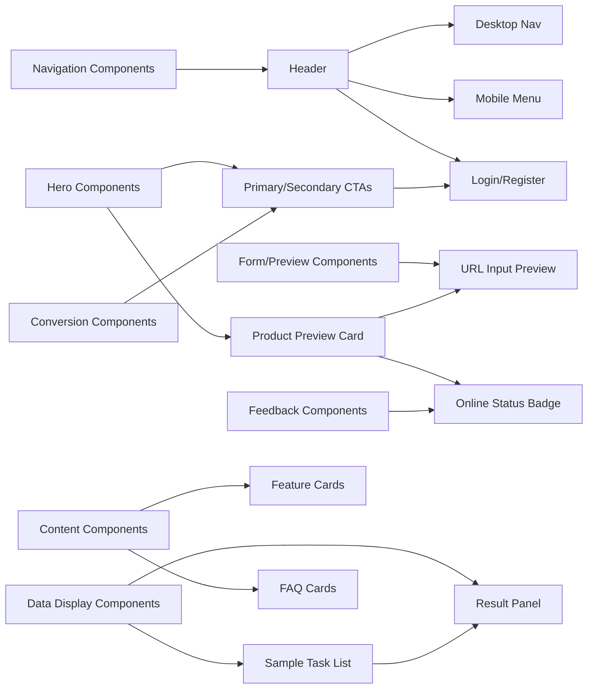

# Component Relationship Map

This diagram groups reusable components by page area and shows how they support conversion.

```mermaid
flowchart LR
  NavGroup["Navigation Components"]
  HeroGroup["Hero Components"]
  FormGroup["Form/Preview Components"]
  ContentGroup["Content Components"]
  FeedbackGroup["Feedback Components"]
  DataGroup["Data Display Components"]
  ConversionGroup["Conversion Components"]

  Header["Header"]
  DesktopNav["Desktop Nav"]
  MobileMenu["Mobile Menu"]
  CTA["Primary/Secondary CTAs"]
  PreviewCard["Product Preview Card"]
  URLPreview["URL Input Preview"]
  Status["Online Status Badge"]
  FeatureCards["Feature Cards"]
  SampleList["Sample Task List"]
  ResultPanel["Result Panel"]
  FAQ["FAQ Cards"]
  Auth["Login/Register"]

  NavGroup --> Header
  Header --> DesktopNav
  Header --> MobileMenu
  Header --> Auth
  HeroGroup --> CTA
  HeroGroup --> PreviewCard
  FormGroup --> URLPreview
  PreviewCard --> URLPreview
  PreviewCard --> Status
  ContentGroup --> FeatureCards
  ContentGroup --> FAQ
  DataGroup --> SampleList
  DataGroup --> ResultPanel
  FeedbackGroup --> Status
  ConversionGroup --> CTA
  CTA --> Auth
  SampleList --> ResultPanel
```

