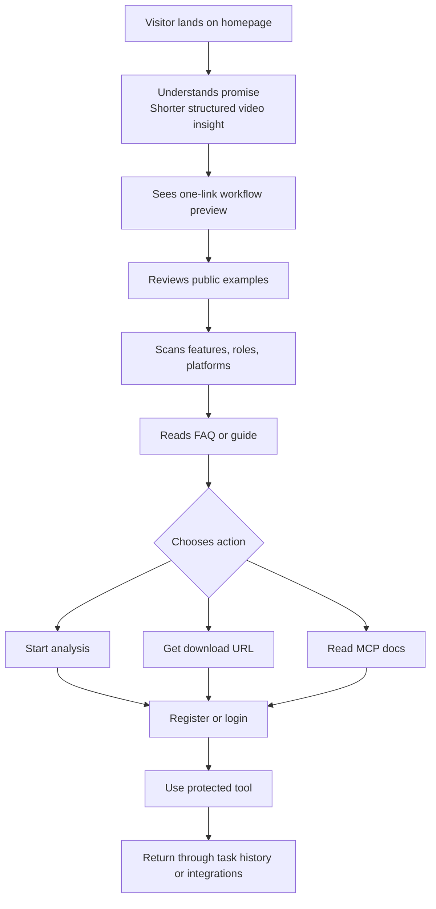

# User Conversion Flow

This diagram summarizes the observed conversion strategy from landing to registered use.

```mermaid
flowchart TD
  Visit["Visitor lands on homepage"]
  Understand["Understands promise\nShorter structured video insight"]
  Preview["Sees one-link workflow preview"]
  Proof["Reviews public examples"]
  Segment["Scans features, roles, platforms"]
  Objections["Reads FAQ or guide"]
  CTA{"Chooses action"}
  Analysis["Start analysis"]
  Download["Get download URL"]
  Docs["Read MCP docs"]
  Register["Register or login"]
  Use["Use protected tool"]
  Return["Return through task history or integrations"]

  Visit --> Understand --> Preview --> Proof --> Segment --> Objections --> CTA
  CTA --> Analysis --> Register
  CTA --> Download --> Register
  CTA --> Docs --> Register
  Register --> Use --> Return
```

