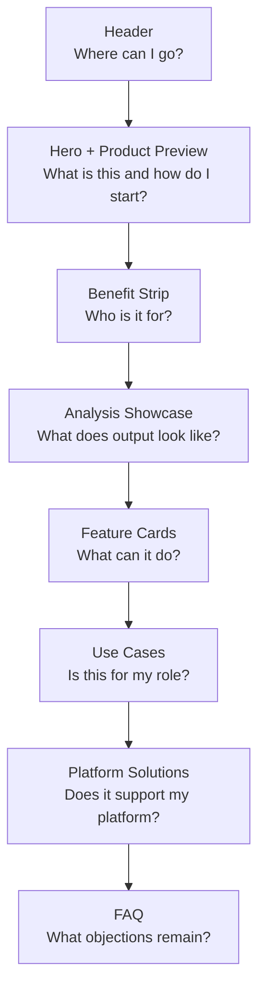

# Homepage Section Flow

This diagram shows the visible homepage section order and the main user question answered by each section.

```mermaid
flowchart TD
  Header["Header\nWhere can I go?"]
  Hero["Hero + Product Preview\nWhat is this and how do I start?"]
  Benefit["Benefit Strip\nWho is it for?"]
  Showcase["Analysis Showcase\nWhat does output look like?"]
  Features["Feature Cards\nWhat can it do?"]
  UseCases["Use Cases\nIs this for my role?"]
  Solutions["Platform Solutions\nDoes it support my platform?"]
  FAQ["FAQ\nWhat objections remain?"]

  Header --> Hero --> Benefit --> Showcase --> Features --> UseCases --> Solutions --> FAQ
```

