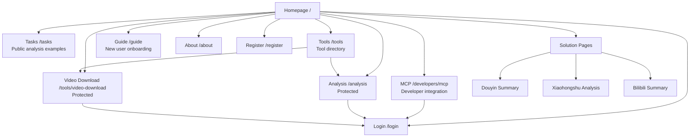

# Sitemap Diagram

This diagram maps the public routes and protected-entry routes observed during inspection.

```mermaid
flowchart TD
  Home["Homepage /"]
  Tasks["Tasks /tasks\nPublic analysis examples"]
  Tools["Tools /tools\nTool directory"]
  Guide["Guide /guide\nNew user onboarding"]
  MCP["MCP /developers/mcp\nDeveloper integration"]
  About["About /about"]
  Login["Login /login"]
  Register["Register /register"]
  Analysis["Analysis /analysis\nProtected"]
  Download["Video Download /tools/video-download\nProtected"]
  Solutions["Solution Pages"]
  Douyin["Douyin Summary"]
  XHS["Xiaohongshu Analysis"]
  Bili["Bilibili Summary"]

  Home --> Tasks
  Home --> Tools
  Home --> Guide
  Home --> MCP
  Home --> About
  Home --> Login
  Home --> Register
  Home --> Analysis
  Home --> Download
  Home --> Solutions
  Tools --> Analysis
  Tools --> Download
  MCP --> Login
  Solutions --> Douyin
  Solutions --> XHS
  Solutions --> Bili
  Analysis --> Login
  Download --> Login
```

